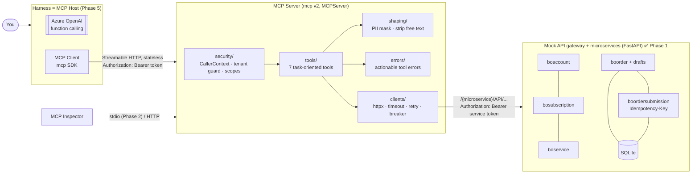

# Telco MCP Lab

A **local learning sandbox** for the [Model Context Protocol](https://modelcontextprotocol.io)
(spec revision **2026-07-28**, the stateless one), built with the official
Python SDK (`mcp` **2.2.0**). It mirrors the planned production design
(Spring Boot 4.1 + Spring AI 2.0, stateless MCP, Cloud Foundry) so every
concept transfers to Java.

> ⚠️ Learning project, not production. All data is synthetic (see
> [docs/02-mock-backend.md](docs/02-mock-backend.md#synthetic-data)). No secrets
> in code; configuration lives in `.env` (gitignored).

## Status

| Phase | Content | State |
|---|---|---|
| 1 | Concepts primer, project skeleton, mock telecom APIs + tests | ✅ done |
| 2 | First tool over **stdio**, MCP Inspector, JSON-RPC walkthrough | ⏳ next |
| 3 | Stateless **Streamable HTTP**, read tools, CallerContext, tenant guard, masking | |
| 4 | `prepare_order` / `submit_order`, idempotency via MCP, concurrency test | |
| 5 | Azure OpenAI harness with step-by-step tool-call trace | |
| 6 | Evaluation suite + description-rewording experiment | |
| 7 | Wrap-up: Spring AI mapping, pitfalls, production checklist | |

## Quick start

Prerequisites: [uv](https://docs.astral.sh/uv/getting-started/installation/),
GNU make, curl. Node 20+ is needed from Phase 2 (MCP Inspector).
uv downloads Python 3.12 automatically if you don't have it.

```bash
make setup     # install pinned deps (uv.lock) into .venv, Python 3.12
make env       # create .env with a random gateway token (never overwrites)
make check     # lint + full test suite; should be green before anything else

# terminal 1
make mocks     # mock gateway on http://127.0.0.1:8081  (OpenAPI UI: /docs)
# terminal 2
make smoke     # real-HTTP walkthrough: bearer auth, reads, draft, idempotent submit
```

Run `make` for all targets. Current list:

| Target | What it does |
|---|---|
| `setup` / `env` | Install deps; create `.env` (mode 600, random key) |
| `mocks` | Start the mock API gateway (all five microservices) |
| `smoke` | End-to-end check against the running gateway, via the MCP gateway client |
| `chaos-slow` / `chaos-fail` / `chaos-off` / `chaos-status` | Inject 5 s latency / 503s into the backend, or turn it off |
| `test` / `test-fast` / `test-mocks` / `test-client` / `test-security` | Full suite / no slow tests / mock gateway / MCP gateway client / security-marked only |
| `lint` / `fmt` / `check` | Ruff (incl. `S` security rules) / auto-fix / lint + tests |
| `reset-data` / `clean` | Wipe backend SQLite data / caches |

## Architecture (target by Phase 5)



Two trust boundaries, deliberately different:

* **User → MCP server:** bearer token → *tenant + scopes*. The tenant is
  enforced by the MCP server.
* **MCP server → gateway:** the MCP server's **own** service token (Option A).
  The caller's token is never passed through, which the MCP spec forbids. The
  gateway and backends trust the MCP server completely, which is why the MCP
  server must never let arguments choose the tenant.

## Repository layout

```
src/telco_mcp_lab/
  gateway_routes.py     shared gateway path layout: /{microservice}/API/... (placeholders)
  mock_apis/            Phase 1: FastAPI mock gateway + telecom microservices
    app.py              app factory, bearer auth, error handlers, admin/chaos endpoints
    routers/            accounts, subscriptions, services, orders, submissions
    store.py            SQLite drafts/orders/idempotency ("exactly once" lives here)
    data.py             synthetic tenants, lines, and the prompt-injection note
    problems.py         RFC 9457 Problem Details
    chaos.py            latency/failure injection middleware
  mcp_server/           Phase 2+: security/ tools/ clients/ shaping/ errors/
    clients/gateway.py  gateway URLs, TokenProvider seam, bearer auth, localhost interlock
tests/                  pytest; markers: security, slow
scripts/smoke_mocks.py  real-HTTP smoke test
docs/                   01-concepts.md (primer), 02-mock-backend.md, … one per phase
```

## Concept → Python → Java/Spring AI

Grows each phase. Full version and verification notes are in
[docs/01-concepts.md §9](docs/01-concepts.md#9-python--java-quick-map-grows-every-phase).

| Concept | Python (this lab) | Java / Spring AI 2.0 |
|---|---|---|
| MCP server | `MCPServer("telco")` | `spring-ai-starter-mcp-server-webmvc` |
| Tool | `@mcp.tool()` + type hints | `@McpTool` + `@McpToolParam` |
| Stateless HTTP | 2026-07-28 automatic; `stateless_http=True` for legacy clients | `spring.ai.mcp.server.protocol=STATELESS` (**2025-era protocol; see primer §6**) |
| Downstream error format | RFC 9457 Problem Details | `ProblemDetail` / `@RestControllerAdvice` |
| Config & secrets | `pydantic-settings` + `.env` | `@ConfigurationProperties` + env / CF user-provided service |
| Gateway service token | `TokenProvider` + `httpx.Auth` hook | `OAuth2AuthorizedClientManager` + `OAuth2ClientHttpRequestInterceptor` |
| Idempotent submit | unique `(account, key)` + `BEGIN IMMEDIATE` | unique index + `@Transactional` |
| Timeouts/retry/breaker | httpx + small wrapper (Phase 3) | Resilience4j (`@TimeLimiter`, `@Retry`, `@CircuitBreaker`) |

## Key findings so far (verified 2026-09-25)

1. **Python SDK v2 serves both protocol eras on one endpoint**, routed by the
   `MCP-Protocol-Version` header. `stateless_http=True` only affects the
   *legacy* (pre-2026, `initialize`-based) path.
2. **The MCP Java SDK (`main`) only knows protocol versions up to 2025-11-25.**
   Spring AI's `STATELESS` mode is very likely stateless Streamable HTTP on the
   older protocol, not the 2026-07-28 protocol. Verify against your team's
   pinned versions. Details and impact: primer §6.
3. The spec explicitly allows `tools/list` to vary **by the authorization on
   the request** (scope-based filtering), and recommends **server-minted
   handles** for cross-call state, which is our `draftId`.

## Documentation

* [docs/01-concepts.md](docs/01-concepts.md): host/client/server, primitives,
  JSON-RPC, transports, what 2026-07-28 changed, why stateless matters on CF,
  security model.
* [docs/02-mock-backend.md](docs/02-mock-backend.md): gateway conventions and
  auth, APIs, synthetic data, Problem Details, draft → submit, idempotency
  guarantees, chaos switch.

## Decisions log

| Decision | Choice |
|---|---|
| Python | 3.12, exact pins + `uv.lock` |
| Config | `.env` only (gitignored), `.env.example` committed |
| Domain API access | Via API gateway, `/{microservice}/API/{resource}`, placeholder names |
| Gateway auth | **Option A**: MCP server's own service token (no passthrough); static now, `TokenProvider` seam for OAuth later |
| Lab targets | Mock gateway only; non-localhost refused unless explicitly allowed |
| Azure OpenAI | Through your HTTPS proxy, API key from `.env` (details confirmed in Phase 5) |
| Idempotency key | Model-supplied argument, enforced by backend; risk documented and tested |
| Destructive calls | Host asks for y/N confirmation before `submit_order` |
