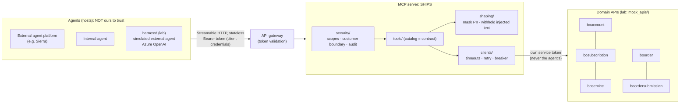

# Telco MCP Lab

A **local learning sandbox** for the [Model Context Protocol](https://modelcontextprotocol.io)
(spec revision **2026-07-28**, the stateless one), built with the official
Python SDK (`mcp` **2.2.0**). It mirrors the planned production design
(Spring Boot 4.1 + Spring AI 2.0, stateless MCP, Cloud Foundry) so every
concept transfers to Java.

> ⚠️ Learning project, not production. All data is synthetic (see
> [docs/02-mock-backend.md](docs/02-mock-backend.md#synthetic-data)). No secrets
> in code; configuration lives in `.env` (gitignored).

## Status

| Phase | Content | State |
|---|---|---|
| 1 | Concepts primer, project skeleton, mock gateway + telecom APIs + tests | ✅ done |
| 2 | First tool over **stdio**, MCP Inspector, JSON-RPC walkthrough | ✅ done |
| 3 | Stateless **Streamable HTTP**, read tools, CallerContext, tenant guard, masking, resilience, audit | ✅ done |
| 4 | Order flow (preview → answers → submit), separate scopes, idempotency via MCP | ⏸ parked: awaiting real preview/submit API contracts ([docs/91](docs/91-backlog-orders-preview-submit.md)) |
| 5 | Azure OpenAI harness with step-by-step tool-call trace | ✅ done (offline-tested; run `make harness-check` on your machine) |
| 5b | Prompt layers (routing / server instructions / agent prompt) and host guardrails | ✅ done ([docs/05b](docs/05b-prompts-and-guardrails.md)) |
| E1 | External-agent readiness: boundary + architecture test, generated tool catalog, integrator guide | ✅ done ([docs/06](docs/06-external-agents.md)) |
| E2 (internal) | JWT validation at the server (token service JWKS, iss/aud/exp/lifetime), client registry, customer-context header, `/healthz` | ✅ done, dev token-service stand-in ([docs/07](docs/07-internal-jwt.md)); real token-service values to confirm |
| E2 (external) | Signed customer handle (B2), step-up / scope challenges | parked (agent platform set aside) |
| E3 | Rate limiting per client/customer, catalog versioning in `_meta` | planned |
| 6 | Evaluation suite + description-rewording experiment | |
| 7 | Wrap-up: Spring AI mapping, pitfalls, production checklist | |

## Quick start

Prerequisites: [uv](https://docs.astral.sh/uv/getting-started/installation/),
GNU make, curl. **Node ≥ 22.19** for MCP Inspector 2.x (Phase 2+).
uv downloads Python 3.12 automatically if you don't have it.

```bash
make setup     # install pinned deps (uv.lock) into .venv, Python 3.12
make env       # create .env with a random gateway token (never overwrites)
make check     # lint + full test suite; should be green before anything else

# terminal 1
make mocks     # mock gateway on http://127.0.0.1:8081  (OpenAPI UI: /docs)
# terminal 2
make smoke     # real-HTTP walkthrough: bearer auth, reads, draft, idempotent submit
make demo-stdio          # MCP client ↔ server over stdio, full JSON-RPC wire printed
make inspector           # MCP Inspector web UI against our server

# Phase 3: HTTP (existing .env from earlier phases? run `make env-tokens` once)
make mcp-http            # terminal 2 instead: stateless HTTP on :8090 (bearer auth)
make demo-http           # 4 callers: scopes, tenant guard, masking
make demo-injection      # the injected note, before vs after shaping
make mcp-cluster         # 2 replicas + round-robin LB on :8099 (LEGACY=1 breaks legacy clients)

# E2: internal run with JWT auth (dev token-service stand-in; real values: docs/07 §5-6)
make dev-keys            # once: dev RSA key + JWKS in .data/dev-keys
make mcp-http-jwt        # terminal 2 instead: JWT mode
make demo-jwt            # refused tokens, bound vs customer-context clients, registry
make token CLIENT=care-agent-internal SCOPES="read pii:read"   # token for Inspector/curl

# Phase 5: Azure OpenAI as the host (fill AZURE_OPENAI_* in .env; see docs/05)
make harness-check       # MCP ✅, Azure settings ✅, one tiny completion ✅
make ask Q="what plans am I on?"      # full step trace; CALLER=bob to switch identity
make chat                             # multi-turn
```

Run `make` for all targets. Current list:

| Target | What it does |
|---|---|
| `setup` / `env` | Install deps; create `.env` (mode 600, random key) |
| `mocks` | Start the mock API gateway (all five microservices) |
| `smoke` | End-to-end check against the running gateway, via the MCP gateway client |
| `mcp-stdio` | Run the MCP server on stdio |
| `demo-stdio` / `demo-stdio-legacy` | Python MCP client over stdio (2026-07-28 / legacy handshake) with wire trace |
| `inspector` / `inspector-cli-list` / `inspector-cli-call` | MCP Inspector 2.8.0, web or headless (`ACCOUNT=`, `ERA=`) |
| `traces` | List captured JSON-RPC traces (`.data/traces`) |
| `env-tokens` | Add the Phase 3 caller tokens to an existing `.env` |
| `catalog` | Regenerate `docs/tool-catalog.md` from the live tool definitions (drift-tested) |
| `harness-check` / `ask` / `chat` | Azure OpenAI harness: connectivity check; one question; interactive (`CALLER=`) |
| `mcp-http` / `mcp-cluster` | Stateless Streamable HTTP server; 2 replicas + round-robin LB |
| `dev-keys` / `token` / `mcp-http-jwt` / `demo-jwt` / `test-jwt` | E2 JWT mode: dev keys + tokens (`CLIENT=`, `SCOPES=`), server, walkthrough, tests |
| `demo-http` / `demo-injection` / `inspector-http` | HTTP walkthrough per caller; injection before/after; Inspector UI for HTTP |
| `chaos-slow` / `chaos-fail` / `chaos-off` / `chaos-status` | Inject 5 s latency / 503s into the backend, or turn it off |
| `test` / `test-fast` / `test-mocks` / `test-client` / `test-harness` / `test-protocol` / `test-security` | Full suite / no slow tests / mock gateway / MCP server / harness (offline) / real-transport protocol tests / security-marked |
| `lint` / `fmt` / `check` | Ruff (incl. `S` security rules) / auto-fix / lint + tests |
| `reset-data` / `clean` | Wipe backend SQLite data / caches |

## What ships vs the lab rig

**The MCP server has no LLM.** Agents (hosts), internal or external such as
an agent platform, bring their own model and call our tools. Everything in
this repo is either the **server you ship** or a **lab rig** that stands in for
the world around it. An architecture test (`tests/test_architecture.py`) fails
if the server ever imports the rig or an LLM SDK.

| Ships (production candidate) | Lab rig (never deployed) |
|---|---|
| `src/telco_mcp_lab/mcp_server/`: the MCP server | `harness/`: **simulated external agent** (Azure OpenAI host) used to test and evaluate the tools |
| `ids.py`, `gateway_routes.py`: shared contract modules | `mock_apis/`: stands in for the API gateway + domain APIs |
| `config/access.json`, `config/clients.json` (client registry) | `devtools/`: round-robin LB (gorouter stand-in), **dev token issuer** (token-service stand-in) |
| `docs/tool-catalog.md` (generated contract) | `scripts/`: demos, wire tracer, smoke tests |
| `docs/06-external-agents.md` (integrator guide) | `prompts/`, `config/guardrails.json`: the *agent's* prompt/guardrails (examples of what an agent owns) |



Two trust boundaries, deliberately different:

* **Agent → MCP server:** untrusted. Token → client + scopes; the server
  enforces scopes and the customer boundary itself, and never relies on the
  agent's prompt or confirmation UI.
* **MCP server → gateway:** the MCP server's **own** service token. The
  agent's token is never passed through (the MCP spec forbids it). Backends
  trust the MCP server, which is why arguments can never choose the customer.

## Repository layout

```
src/telco_mcp_lab/
  gateway_routes.py     shared gateway path layout: /{microservice}/API/... (placeholders)
  mock_apis/            Phase 1: FastAPI mock gateway + telecom microservices
    app.py              app factory, bearer auth, error handlers, admin/chaos endpoints
    routers/            accounts, subscriptions, services, orders, submissions
    store.py            SQLite drafts/orders/idempotency ("exactly once" lives here)
    data.py             synthetic tenants, lines, and the prompt-injection note
    problems.py         RFC 9457 Problem Details
    chaos.py            latency/failure injection middleware
  ids.py                ID formats: the shared contract between mocks and tool schemas
  mcp_server/           the MCP server (layers: security/ tools/ clients/ shaping/ errors/)
    __main__.py         entry point: --transport stdio|http, logs → stderr
    server.py           composition root: server, instructions, lifespan, tool registration
    http_app.py         stateless Streamable HTTP app (auth, DNS-rebinding protection)
    settings.py         MCP_* settings
    state.py            process-wide AppState (pooled HTTP client only; no caller state)
    security/           verifier (static) · jwt_verifier (JWKS) · clients (registry, customer header)
                        · caller (CallerContext) · scoped_server
                        (tool filtering/enforcement/audit) · guard (tenant) · audit
    clients/            gateway (URLs, TokenProvider) · telco (typed client) · resilience
    shaping/            pii (masking) · free_text (injection neutralising)
    errors/tool_errors.py  failures → actionable, non-leaky tool errors
    tools/              account · lines (subscriptions, service details) · orders
  harness/              Phase 5: the MCP HOST: settings · llm (Azure adapter) · bridge
                        (MCP ⇄ function calling) · agent (loop + guards) · prompts ·
                        guardrails · trace · CLI
  devtools/round_robin_lb.py  gorouter stand-in for the scaling demo
  devtools/token_issuer.py    DEV-ONLY token-service stand-in: RSA key, JWKS, mint tokens
config/access.json      tenants → accounts, callers → tenant + scopes (non-secret)
config/clients.json     JWT mode: registered client_ids, bound/customer_context, allowed scopes
config/guardrails.json  host guardrails: input redact/block/warn, grounded-identifier output rule
prompts/agent.system.md the host's (agent's) system prompt: versioned, eval-gated
tests/                  pytest; markers: security, slow
scripts/smoke_mocks.py  real-HTTP smoke test of the mock gateway
scripts/stdio_trace.py  transparent stdio proxy that logs every JSON-RPC message
scripts/stdio_demo.py   scripted MCP client over stdio (modern or legacy era)
scripts/http_demo.py    HTTP walkthrough as alice / bob / carol / mallory
scripts/injection_demo.py  prompt-injection note: backend → model, before/after
scripts/jwt_demo.py     JWT mode walkthrough: refused tokens, bound vs customer-context, registry
docs/                   01-concepts.md (primer), 02-mock-backend.md, … one per phase
```

## Concept → Python → Java/Spring AI

Grows each phase. Full version and verification notes are in
[docs/01-concepts.md §9](docs/01-concepts.md#9-python--java-quick-map-grows-every-phase).

| Concept | Python (this lab) | Java / Spring AI 2.0 |
|---|---|---|
| MCP server | `MCPServer("telco")` | `spring-ai-starter-mcp-server-webmvc` |
| Tool | `@mcp.tool(name, title, description, annotations=ToolAnnotations(read_only_hint=True))` | `@McpTool(…, annotations = @McpTool.McpAnnotations(readOnlyHint = true))` + `@McpToolParam` |
| Structured output | Pydantic return model → `outputSchema` + `structuredContent` | Java record return type |
| Tool error (model-fixable) | `raise ToolError("…")` → `isError: true` | exception → error result (verify exact mapping in Phase 7) |
| stdio server | `MCPServer.run(transport="stdio")`, logs to stderr | `spring-ai-starter-mcp-server` + `spring.ai.mcp.server.stdio=true` |
| Bearer auth seam | SDK `TokenVerifier` → `AccessToken` (static now, JWT later) | `oauth2-resource-server` + `JwtDecoder` (issuer + audience) |
| Caller identity | `CallerContext` from `get_access_token()` | `SecurityContextHolder` / `JwtAuthenticationConverter` |
| Scope-filtered tools | override `list_tools()` / `call_tool()` | per-request `ToolCallback` filter + `@PreAuthorize` |
| Tenant guard | `resolve_account()` / `ensure_owned()` | `PermissionEvaluator` / service-layer ownership check |
| Retry / breaker | `clients/resilience.py` | Resilience4j `@Retry` / `@CircuitBreaker` / `@TimeLimiter` |
| Audit | JSON line on `telco_mcp.audit` | `@Around` aspect / Micrometer Observation + SLF4J |
| Host: MCP tools → LLM functions | `harness/bridge.py` | `SyncMcpToolCallbackProvider` → `ToolCallback` |
| Host: tool-calling loop | `harness/agent.py` (by hand, traced) | `ChatClient` internal tool execution / `ToolCallingManager` |
| LLM client | `openai.AsyncOpenAI(base_url=…/openai/v1/)` | `AzureOpenAiChatModel` / `OpenAiChatModel` |
| Agent system prompt | `prompts/agent.system.md` | `ChatClient.defaultSystem(Resource)` |
| Server instructions | `MCPServer(instructions=…)` | `spring.ai.mcp.server.instructions` |
| Host guardrails | `harness/guardrails.py` + `config/guardrails.json` | custom `CallAdvisor`s (`SafeGuardAdvisor` = word blocklist only) |
| Stateless HTTP | 2026-07-28 automatic; `stateless_http=True` for legacy clients | `spring.ai.mcp.server.protocol=STATELESS` (**2025-era protocol; see primer §6**) |
| Downstream error format | RFC 9457 Problem Details | `ProblemDetail` / `@RestControllerAdvice` |
| Config & secrets | `pydantic-settings` + `.env` | `@ConfigurationProperties` + env / CF user-provided service |
| Gateway service token | `TokenProvider` + `httpx.Auth` hook | `OAuth2AuthorizedClientManager` + `OAuth2ClientHttpRequestInterceptor` |
| Idempotent submit | unique `(account, key)` + `BEGIN IMMEDIATE` | unique index + `@Transactional` |
| Timeouts/retry/breaker | httpx + small wrapper (Phase 3) | Resilience4j (`@TimeLimiter`, `@Retry`, `@CircuitBreaker`) |

## Key findings so far (verified 2026-09-25)

1. **Python SDK v2 serves both protocol eras on one endpoint**, routed by the
   `MCP-Protocol-Version` header. `stateless_http=True` only affects the
   *legacy* (pre-2026, `initialize`-based) path.
2. **The MCP Java SDK (`main`) only knows protocol versions up to 2025-11-25.**
   Spring AI's `STATELESS` mode is very likely stateless Streamable HTTP on the
   older protocol, not the 2026-07-28 protocol. Verify against your team's
   pinned versions. Details and impact: primer §6.
3. The spec explicitly allows `tools/list` to vary **by the authorization on
   the request** (scope-based filtering), and recommends **server-minted
   handles** for cross-call state, which is our `draftId`.
4. **`mcp` v2 diverts stray `print()` output away from the stdio protocol
   stream** (fd 1 → stderr). Other stacks, including Spring Boot, don't do this for you.
5. **MCP Inspector 2.8.0's CLI defaults to the legacy era**; `ERA=auto` makes it
   use 2026-07-28. The Python SDK returns **unknown tool** as an `isError`
   result, not a JSON-RPC protocol error.
6. **Two replicas behind round-robin:** both eras work with `stateless_http=True`;
   with in-memory sessions the **legacy client fails (404 on the other replica)**
   while the 2026-07-28 client is unaffected. That's your Cloud Foundry reality with today's Spring AI.
7. httpx's in-process `ASGITransport` ignores timeouts, and `httpx` logs full
   URLs (identifiers) at INFO. Both are handled; see docs/04.
8. `openai` 3.x and `mcp` 2.x both use **`httpx2`**, which honours `HTTPS_PROXY`
   automatically. Good for Azure, but on a corporate laptop it would also capture
   *localhost* MCP/gateway calls. Local clients now ignore proxy env vars (tested).

## Documentation

* [docs/01-concepts.md](docs/01-concepts.md): host/client/server, primitives,
  JSON-RPC, transports, what 2026-07-28 changed, why stateless matters on CF,
  security model.
* [docs/03-stdio-first-tool.md](docs/03-stdio-first-tool.md): tool anatomy,
  stdio rules, captured JSON-RPC wire walkthrough (modern vs legacy), error
  channels, MCP Inspector how-to, known gaps.
* [docs/04-http-security-scaling.md](docs/04-http-security-scaling.md):
  stateless HTTP and the 2-replica experiment, CallerContext, scopes, tenant
  guard + security matrix, PII masking, injection before/after, resilience,
  audit.
* [docs/05-llm-harness.md](docs/05-llm-harness.md): the host loop, real
  step trace, host guards and y/N confirmation, data boundary to Azure, v1
  endpoint + corporate proxy config, `harness-check` diagnostics.
* [docs/06-external-agents.md](docs/06-external-agents.md): **integrator
  guide** for agent teams (internal and external): connecting, auth, customer
  context, errors, data handling, responsibilities, open decisions.
* [docs/07-internal-jwt.md](docs/07-internal-jwt.md): **running internally**: JWT
  validation, client registry, customer-context header, run steps, the values to
  confirm with the token-service team, and what changes before real APIs.
* [docs/tool-catalog.md](docs/tool-catalog.md): **generated** tool contract with catalog hash.
* [docs/92-industry-gap-analysis.md](docs/92-industry-gap-analysis.md): scorecard
  against the 2026-07-28 spec + security best practices.
* [docs/05b-prompts-and-guardrails.md](docs/05b-prompts-and-guardrails.md):
  where routing (tool descriptions), server instructions, the agent prompt and
  guardrails each live; who owns them; what's enforced where; Spring AI mapping.
* [docs/91-backlog-orders-preview-submit.md](docs/91-backlog-orders-preview-submit.md):
  **parked** Phase 4 design: separate `order:preview` / `order:submit` scopes,
  multi-step preview via server-minted handle (recommended) vs MRTR elicitation.
* [docs/90-backlog-external-validation.md](docs/90-backlog-external-validation.md):
  **parked** plan for validating against the official conformance suite,
  reference servers and other implementations (findings as of 2026-09-25).
* [docs/02-mock-backend.md](docs/02-mock-backend.md): gateway conventions and
  auth, APIs, synthetic data, Problem Details, draft → submit, idempotency
  guarantees, chaos switch.

## Decisions log

| Decision | Choice |
|---|---|
| Python | 3.12, exact pins + `uv.lock` |
| Config | `.env` only (gitignored), `.env.example` committed |
| Domain API access | Via API gateway, `/{microservice}/API/{resource}`, placeholder names |
| Gateway auth | **Option A**: MCP server's own service token (no passthrough); static now, `TokenProvider` seam for OAuth later |
| Lab targets | Mock gateway only; non-localhost refused unless explicitly allowed |
| Azure OpenAI | Through your HTTPS proxy, API key from `.env` (details confirmed in Phase 5) |
| Idempotency key | Model-supplied argument, enforced by backend; risk documented and tested |
| Destructive calls | Host asks for y/N confirmation before `submit_order` |
| Agent → MCP auth (E2) | JWT from the internal token service (client credentials, `scope` claim, `aud` = MCP server), **validated at the MCP server** via JWKS; gateway scope headers ignored |
| Agent clients | Registry (`config/clients.json`); effective scopes = token ∩ allowed; unregistered = nothing |
| Customer context (internal) | `X-Customer-Account-Id` set by agent **code**, only for `customer_context` clients; never a tool argument as authority |
