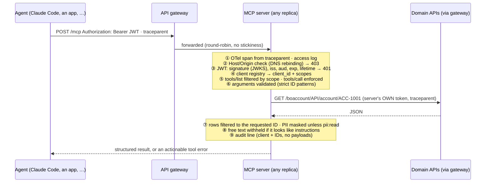

# Telco MCP Server

A stateless [Model Context Protocol](https://modelcontextprotocol.io) server (spec
**2026-07-28**, Python SDK `mcp` **2.2.0**) that exposes a mobile operator's account,
line and order APIs as **tools** for internal AI agents. It started as a learning lab
and is being hardened for production; it mirrors the planned Spring AI design, so each
concept maps to Java.

> All data is synthetic. No secrets in code: configuration comes from environment
> variables (locally `.env`, gitignored). **Contributors and coding agents: read
> [AGENTS.md](AGENTS.md) first.**

## What ships and what doesn't

```
server/        telco-mcp-server  (package telco_mcp)       ← SHIPS as the Docker image
  src/telco_mcp/     __main__ · http_app · server · settings · state · catalog
                     security/  jwt_verifier · clients (registry) · scoped_server · audit · environment (G2)
                     tools/     account · lines · orders · common (shared args)
                     clients/   gateway (URLs, token) · telco (typed client) · resilience (retry, breaker)
                     shaping/   pii (masking) · free_text (injection)
                     errors/    tool_errors (safe messages)
                     observability/  logs (ECS JSON) · access · fields · telemetry (OpenTelemetry)
                     ids · endpoints   (ID formats; the gateway endpoint catalogue)
  config/clients.json  client registry sample (production mounts its own)
lab/           telco-mcp-lab     (package telco_mcp_lab)   ← NEVER ships: local testing rig
  src/telco_mcp_lab/ mock_apis (fake gateway + APIs) · harness (LLM test client: Claude /
                     Gemini / Azure) · devtools (dev token service, round-robin LB) ·
                     connect (developer token helper / stdio bridge)
  scripts/ · prompts/ · config/guardrails.json
tests/         server + lab tests (pytest)          docs/   design notes, one per topic
Dockerfile     two-stage, server only, non-root     AGENTS.md · .agent/skills/   rules + playbooks
```

The server has **no LLM**: agents bring their own model and call our tools. The lab
stands in for everything around the server (gateway, APIs, token service, an agent).
`tests/test_architecture.py` fails if the server imports lab code, an LLM SDK or an
undeclared dependency, and the image is checked to contain none of them (docs/10 §5).

## How a request flows


```mermaid
sequenceDiagram
    participant A as Agent (Claude Code, an app, …)
    participant G as API gateway
    participant S as MCP server (any replica)
    participant B as Domain APIs (via gateway)
    A->>G: POST /mcp  Authorization: Bearer JWT · traceparent
    G->>S: forwarded (round-robin, no stickiness)
    Note over S: ① OTel span from traceparent · access log<br/>② Host/Origin check (DNS rebinding) → 403<br/>③ JWT: signature (JWKS), iss, aud, exp, lifetime → 401<br/>④ client registry → client_id + scopes<br/>⑤ tools/list filtered by scope · tools/call enforced<br/>⑥ arguments validated (strict ID patterns)
    S->>B: GET /boaccount/API/account/ACC-1001  (server's OWN token, traceparent)
    B-->>S: JSON
    Note over S: ⑦ rows filtered to the requested ID · PII masked unless pii:read<br/>⑧ free text withheld if it looks like instructions<br/>⑨ audit line (client + IDs, no payloads)
    S-->>A: structured result, or an actionable tool error
```

| Step | Code |
|---|---|
| Entry point, logging/telemetry setup | `server/src/telco_mcp/__main__.py`, `http_app.py` |
| ③④ auth and identity | `security/jwt_verifier.py`, `security/clients.py` |
| ⑤⑨ scope filter, audit, tool span | `security/scoped_server.py`, `security/audit.py` |
| ⑥⑦⑧ the tools | `tools/*.py`, `shaping/*.py`, `errors/tool_errors.py` |
| downstream calls | `clients/telco.py`, `clients/resilience.py` |

Identity is one concept, the **client**. The account ID is a tool argument (the model
takes it from the user) and there is **no per-customer boundary**: an accepted risk
with compensating controls ([docs/08 §1.6](docs/08-access-and-environments.md)). Over
stdio there is no token; the process runs with `MCP_STDIO_SCOPES`.

## Quick start (local)

Prerequisites: [uv](https://docs.astral.sh/uv/getting-started/installation/)
(`brew install uv`, or `curl -LsSf https://astral.sh/uv/install.sh | sh`, or behind a
proxy `python3 -m pip install --user uv`), make, bash, curl; Node ≥ 22.19 only for MCP
Inspector; Docker only for the image. `make doctor` checks all of it.

```bash
make doctor setup env        # prerequisites, install (uv workspace: server + lab), create .env
make check                   # lint + full test suite: green before anything else
make env-update              # existing .env? add new settings, flag retired/moved ones

make mocks                   # terminal 1: mock gateway + APIs on :8081 (OpenAPI UI: /docs)
```

Then pick how to run the server:

| Mode | Commands | Use it for |
|---|---|---|
| **stdio** (no auth, scopes from `MCP_STDIO_SCOPES`) | `make demo-stdio`, `make inspector`, or register in Claude Code (below) | trying tools, MCP hosts on your laptop |
| **HTTP** (JWT, like production) | `make dev-keys` once, `make mcp-http`, `make demo-http`, `make token` | the production path locally |
| **Docker image** | `make docker-build docker-run` (port 8093) | exactly what ships |
| **Real model end to end** | key in `.env` (`CHAT_CLAUDE_API_KEY` / `CHAT_GEMINI_API_KEY` / `AZURE_OPENAI_*`), `make model-check LLM=claude` | checking a model uses the tools correctly |

Register in Claude Code (stdio; run from the repo root):

```bash
claude mcp add telco-lab -- uv run --directory "$PWD" python -m telco_mcp
```

Ask with an account ID, e.g. *"summarise account ACC-1001"*. Accounts: `ACC-1001`,
`ACC-1002`, `ACC-2001`. For the lower-env gateway with the shared client, see docs/09.

## Common targets

| Target | What it does |
|---|---|
| `setup` / `env` / `env-update` / `doctor` | install; create `.env`; add new settings; check prerequisites |
| `check` / `test` / `lint` / `fmt` | lint + tests; tests only; ruff check; ruff fix |
| `test-security` / `test-protocol` / `test-client` / `test-harness` | subsets by marker/folder |
| `mocks` / `smoke` / `chaos-slow` / `chaos-fail` / `chaos-off` | mock gateway; smoke test; inject latency/503s |
| `mcp-stdio` / `demo-stdio` / `inspector` | server over stdio; scripted client with wire trace; MCP Inspector |
| `mcp-http` / `mcp-cluster` / `demo-http` / `inspector-http` | server over HTTP (JWT); 2 replicas + LB; walkthrough; Inspector |
| `dev-keys` / `token` / `test-jwt` | dev signing keys; mint a token (`CLIENT=`, `SCOPES=`); JWT tests |
| `docker-build` / `docker-run` | production image; run it against the mocks |
| `load-test` | throughput + latency percentiles over HTTP (`N=`, `C=`, `URL=`) |
| `catalog` | regenerate `docs/tool-catalog.md` (a test enforces it) |
| `harness-check` / `ask` / `chat` / `model-check` | LLM harness: connectivity; one question; chat; E2E check (`LLM=`, `TRANSPORT=`) |
| `dev-token-service` / `connect-local` / `connect-check` | lower-env connector rehearsal (docs/09) |

Run `make` for the full list.

## Configuration essentials

All settings are environment variables; `.env.example` lists every one with a comment.

| Group | Key settings |
|---|---|
| Server | `MCP_ENVIRONMENT` (local/dev/test/production), `MCP_HOST`, `MCP_PORT` / `PORT`, `MCP_PUBLIC_URL`, `MCP_ALLOWED_HOSTS`, `MCP_CLIENTS_CONFIG`, `MCP_STDIO_SCOPES` |
| Auth (HTTP) | `MCP_JWT_ISSUER`, `MCP_JWT_AUDIENCE`, `MCP_JWT_JWKS_URL` (production) or `MCP_JWT_JWKS_FILE` (local) |
| Gateway | `GATEWAY_BASE_URL`, `GATEWAY_TOKEN`, `GATEWAY_ALLOW_NON_LOCAL`, timeouts, `GATEWAY_ENDPOINT_*` (one per operation; [docs/11](docs/11-gateway-endpoints.md)) |
| Observability | `MCP_LOG_FORMAT` (json in the image), `MCP_LOG_LEVEL`, `OTEL_EXPORTER_OTLP_ENDPOINT`, `OTEL_TRACES_SAMPLER` |

**Production** (`MCP_ENVIRONMENT=production`) refuses to start with any lab setting:
stdio, text logs, dev JWKS file, mock default endpoints, local/reserved URLs, `--legacy-sessions`, raw free
text, or registry entries not tagged for production (guard G2, docs/08). Not yet
production-ready: gateway OAuth token (static today), rate limiting, metrics,
backpressure, readiness probe, deployment manifests. See [docs/TODO.md](docs/TODO.md).

## Working on the code

* Rules: [AGENTS.md](AGENTS.md) (security, architecture, logging, testing, docs).
* Playbooks: [`coding-style`](.agent/skills/coding-style/SKILL.md),
  [`new-mcp-tool`](.agent/skills/new-mcp-tool/SKILL.md),
  [`pr-review`](.agent/skills/pr-review/SKILL.md). Claude Code loads them via
  `CLAUDE.md` and `.claude/skills` (a link to `.agent/skills`).
* Done means: tests that fail without the change, `make check` green, docs updated
  (AGENTS.md §7), `make catalog` for tool changes.

## Documentation

| Doc | Read it for |
|---|---|
| [01-concepts](docs/01-concepts.md) | MCP primer: host/client/server, transports, what 2026-07-28 changed, security model |
| [02-mock-backend](docs/02-mock-backend.md) | the mock gateway/APIs and synthetic data |
| [03-stdio-first-tool](docs/03-stdio-first-tool.md) | tool anatomy, the JSON-RPC wire, MCP Inspector |
| [04-http-security-scaling](docs/04-http-security-scaling.md) | stateless HTTP and scaling, identity + scopes, the no-boundary decision, masking, injection, resilience, audit |
| [05-llm-harness](docs/05-llm-harness.md), [05b](docs/05b-prompts-and-guardrails.md) | the LLM test harness, providers, prompts and guardrails |
| [06-external-agents](docs/06-external-agents.md) | integrator guide for agent teams |
| [07-internal-jwt](docs/07-internal-jwt.md) | JWT validation, client registry, values to confirm with the token-service team |
| [08-access-and-environments](docs/08-access-and-environments.md) | who connects how per environment, guardrails G1–G11, accepted risks |
| [09-connect-dev-tools](docs/09-connect-dev-tools.md) | connecting VS Code / Claude Code to a lower env |
| [10-observability](docs/10-observability.md) | logs (ECS/ELK), traces (OpenTelemetry), the Docker image, measured cost |
| [11-gateway-endpoints](docs/11-gateway-endpoints.md) | the endpoint catalogue and how to configure it per environment |
| [tool-catalog](docs/tool-catalog.md) | generated tool contract + hash |
| [TODO](docs/TODO.md), [90](docs/90-backlog-external-validation.md), [91](docs/91-backlog-orders-preview-submit.md), [92](docs/92-industry-gap-analysis.md) | parked work, backlog designs, gap analysis |

## Status

| Area | State |
|---|---|
| Read tools over stdio + stateless HTTP, both protocol eras, horizontal scaling | ✅ |
| JWT auth, client registry + scopes, strict IDs, PII masking, injection shaping, audit | ✅ (real token-service values to confirm, docs/07 §6) |
| Production startup guard, environment-tagged registry | ✅ |
| Logging (ECS JSON → ELK), tracing (OpenTelemetry, W3C traceparent), Docker image | ✅ 2026-09-28 (docs/10) |
| Repo split: shipped server vs lab | ✅ 2026-09-28 |
| LLM harness (Claude, Gemini, Azure) + `model-check`; developer connector | ✅ (lab) |
| Metrics, backpressure, readiness, rate limits (Redis), gateway OAuth, manifests | planned (docs/TODO.md) |
| Order flow (preview → submit) | ⏸ awaiting API contracts (docs/91) |

## Concept → Python → Java/Spring AI

Grows each phase. Full version and verification notes are in
[docs/01-concepts.md §9](docs/01-concepts.md#9-python--java-quick-map-grows-every-phase).

| Concept | Python (this lab) | Java / Spring AI 2.0 |
|---|---|---|
| MCP server | `MCPServer("telco")` | `spring-ai-starter-mcp-server-webmvc` |
| Tool | `@mcp.tool(name, title, description, annotations=ToolAnnotations(read_only_hint=True))` | `@McpTool(…, annotations = @McpTool.McpAnnotations(readOnlyHint = true))` + `@McpToolParam` |
| Structured output | Pydantic return model → `outputSchema` + `structuredContent` | Java record return type |
| Tool error (model-fixable) | `raise ToolError("…")` → `isError: true` | exception → error result (verify exact mapping in Phase 7) |
| stdio server | `MCPServer.run(transport="stdio")`, logs to stderr | `spring-ai-starter-mcp-server` + `spring.ai.mcp.server.stdio=true` |
| Bearer auth seam | SDK `TokenVerifier` → `AccessToken` (`JwtTokenVerifier`) | `oauth2-resource-server` + `JwtDecoder` (issuer + audience) |
| Client identity | `ClientContext` from `get_access_token()` + registry | `SecurityContextHolder` / `JwtAuthenticationConverter` |
| Scope-filtered tools | override `list_tools()` / `call_tool()` | per-request `ToolCallback` filter + `@PreAuthorize` |
| Strict IDs | `Field(pattern=…)` on tool args | `@Pattern` on `@McpToolParam` |
| Retry / breaker | `clients/resilience.py` | Resilience4j `@Retry` / `@CircuitBreaker` / `@TimeLimiter` |
| Audit | JSON line on `telco_mcp.audit` | `@Around` aspect / Micrometer Observation + SLF4J |
| Host: MCP tools → LLM functions | `harness/bridge.py` | `SyncMcpToolCallbackProvider` → `ToolCallback` |
| Host: tool-calling loop | `harness/agent.py` (by hand, traced) | `ChatClient` internal tool execution / `ToolCallingManager` |
| LLM client | `openai.AsyncOpenAI(base_url=…/openai/v1/)` | `AzureOpenAiChatModel` / `OpenAiChatModel` |
| Agent system prompt | `lab/prompts/agent.system.md` | `ChatClient.defaultSystem(Resource)` |
| Server instructions | `MCPServer(instructions=…)` | `spring.ai.mcp.server.instructions` |
| Host guardrails | `harness/guardrails.py` + `lab/config/guardrails.json` | custom `CallAdvisor`s (`SafeGuardAdvisor` = word blocklist only) |
| Stateless HTTP | 2026-07-28 automatic; `stateless_http=True` for legacy clients | `spring.ai.mcp.server.protocol=STATELESS` (**2025-era protocol; see primer §6**) |
| Downstream error format | RFC 9457 Problem Details | `ProblemDetail` / `@RestControllerAdvice` |
| Config & secrets | `pydantic-settings` + `.env` | `@ConfigurationProperties` + env / CF user-provided service |
| Gateway service token | `TokenProvider` + `httpx.Auth` hook | `OAuth2AuthorizedClientManager` + `OAuth2ClientHttpRequestInterceptor` |
| Idempotent submit | unique `(account, key)` + `BEGIN IMMEDIATE` | unique index + `@Transactional` |
| Timeouts/retry/breaker | httpx + small wrapper (Phase 3) | Resilience4j (`@TimeLimiter`, `@Retry`, `@CircuitBreaker`) |

## Key findings so far (verified 2026-09-25)

1. **Python SDK v2 serves both protocol eras on one endpoint**, routed by the
   `MCP-Protocol-Version` header. `stateless_http=True` only affects the
   *legacy* (pre-2026, `initialize`-based) path.
2. **The MCP Java SDK (`main`) only knows protocol versions up to 2025-11-25.**
   Spring AI's `STATELESS` mode is very likely stateless Streamable HTTP on the
   older protocol, not the 2026-07-28 protocol. Verify against your team's
   pinned versions. Details and impact: primer §6.
3. The spec explicitly allows `tools/list` to vary **by the authorization on
   the request** (scope-based filtering), and recommends **server-minted
   handles** for cross-call state, which is our `draftId`.
4. **`mcp` v2 diverts stray `print()` output away from the stdio protocol
   stream** (fd 1 → stderr). Other stacks, including Spring Boot, don't do this for you.
5. **MCP Inspector 2.8.0's CLI defaults to the legacy era**; `ERA=auto` makes it
   use 2026-07-28. The Python SDK returns **unknown tool** as an `isError`
   result, not a JSON-RPC protocol error.
6. **Two replicas behind round-robin:** both eras work with `stateless_http=True`;
   with in-memory sessions the **legacy client fails (404 on the other replica)**
   while the 2026-07-28 client is unaffected. That's your Cloud Foundry reality with today's Spring AI.
7. httpx's in-process `ASGITransport` ignores timeouts, and `httpx` logs full
   URLs (identifiers) at INFO. Both are handled; see docs/04.
8. `openai` 3.x and `mcp` 2.x both use **`httpx2`**, which honours `HTTPS_PROXY`
   automatically. Good for Azure, but on a corporate laptop it would also capture
   *localhost* MCP/gateway calls. Local clients now ignore proxy env vars (tested).

## Decisions log

| Decision | Choice |
|---|---|
| Python | 3.12, exact pins + `uv.lock` |
| Config | `.env` only (gitignored), `.env.example` committed |
| Domain API access | Via API gateway, `/{microservice}/API/{resource}`, placeholder names |
| Gateway auth | **Option A**: MCP server's own service token (no passthrough); static now, `TokenProvider` seam for OAuth later |
| Lab targets | Mock gateway only; non-localhost refused unless explicitly allowed |
| Azure OpenAI | Through your HTTPS proxy, API key from `.env` (details confirmed in Phase 5) |
| Idempotency key | Model-supplied argument, enforced by backend; risk documented and tested |
| Destructive calls | Host asks for y/N confirmation before `submit_order` |
| Agent → MCP auth (E2) | JWT from the internal token service (client credentials, `scope` claim, `aud` = MCP server), **validated at the MCP server** via JWKS; gateway scope headers ignored |
| Agent clients | Registry (`server/config/clients.json`); effective scopes = token ∩ allowed; unregistered = nothing |
| Customer context (2026-09-27) | **None.** Account ID is a tool argument → API URL; any `read` client can read any account. Accepted risk (docs/08 §1.6), compensated by scopes, masking, strict IDs, per-ID audit |
| Identity | One concept: the **client** (JWT `client_id` + registry scopes); stdio runs with `MCP_STDIO_SCOPES` |
| Repo layout (2026-09-28) | uv workspace: `server/` (ships, minimal deps) + `lab/` (never ships); boundary enforced by `tests/test_architecture.py` |
| Deployment | One Docker image (server only, non-root) for Cloud Foundry now and EKS later; config via env vars |
| Logging (2026-09-28) | ECS JSON on stdout → ELK, plus OTLP to the collector when configured; W3C `traceparent` correlation; no baggage |
