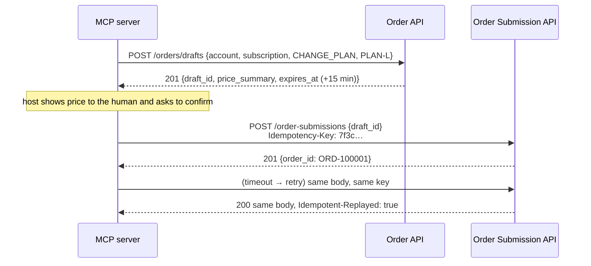

# 02 · Mock telecom backend

The mock backend stands in for your real telecom APIs. It's deliberately
**dumb and trusting**. It authenticates its *service caller* (the MCP server)
with a shared API key, but knows nothing about end users or tenants. That
mirrors a typical enterprise setup, and it's why the MCP server has to enforce
the tenant boundary (Phase 3).

```
make mocks          # http://127.0.0.1:8081, OpenAPI UI at /docs
make smoke          # scripted curl walkthrough against a running mock
make test-mocks     # pytest for this component only
```

## APIs

All endpoints except `/health` require `X-Api-Key: $MOCK_API_KEY`.

| API | Method & path | Notes |
|---|---|---|
| Account | `GET /accounts/{account_id}` | Full PII + free-text `notes` (**ACC-1001 notes carry a prompt injection**) |
| Subscription | `GET /accounts/{account_id}/subscriptions?status=&limit=&cursor=` | Paginated, `status ∈ {ACTIVE, SUSPENDED, TERMINATED}` |
| | `GET /subscriptions/{subscription_id}` | |
| Service | `GET /services/{service_id}` | SIM, features, add-ons, `notes` |
| Order | `GET /accounts/{account_id}/orders?limit=&cursor=` | Newest first |
| | `GET /orders/{order_id}` | |
| | `POST /orders/drafts` | Creates a **draft** (quote). Nothing executes |
| | `GET /orders/drafts/{draft_id}` | |
| Order Submission | `POST /order-submissions` + `Idempotency-Key` header | Draft → real order, **idempotent** |
| Ops | `GET /health` · `GET/POST /_admin/chaos` | Chaos switch (key required) |

ID formats (`mock_apis/ids.py`) are strict regexes: `ACC-1001`, `SUB-1001-01`,
`SVC-1001-01`, `ORD-000123`, `DRF-<32 hex>`. Strict formats are a cheap
security control: an ID that can't match can't carry a traversal, injection or
instruction payload.

## Synthetic data

| Tenant | Accounts | Subscriptions |
|---|---|---|
| tenant-a | `ACC-1001` (consumer, **injected notes**), `ACC-1002` | `SUB-1001-01` ACTIVE, `-02` SUSPENDED, `-03` TERMINATED, `SUB-1002-01` |
| tenant-b | `ACC-2001` (business) | `SUB-2001-01..05` (5 lines, so pagination is visible) |

Seed orders: `ORD-000123`, `ORD-000124` (ACC-1001) and `ORD-000456` (ACC-2001).

The tenant → account mapping is **not in the backend**. It belongs to the MCP
server's CallerContext.

Everything is synthetic, and `tests/mock_apis/test_chaos_and_data.py` fails
the build otherwise:

* MSISDN `+447700900xxx`: Ofcom's range reserved for drama/fiction.
* IMSI `00101xxxxxxxxxx`: MCC 001 / MNC 01, the ITU test network.
* E-mail `*.invalid` (RFC 2606); postcodes `ZZ…` (not a real UK area).

## Errors: RFC 9457 Problem Details

```json
HTTP/1.1 410 Gone
Content-Type: application/problem+json

{"type": "https://errors.telco-mcp-lab.invalid/draft-expired",
 "title": "Draft Expired", "status": 410,
 "detail": "The draft has expired. Create a new draft and submit that instead.",
 "code": "DRAFT_EXPIRED", "expired_at": "2026-09-25T12:15:00Z"}
```

The stable `code` is what the MCP server maps to actionable tool errors.
Validation errors report the *location* of the bad field but **never echo the
input value**, which might be PII or an injection payload.
*Java:* Spring's `ProblemDetail` produces this exact shape.

## Draft → submit: the two-step pattern for destructive actions



### Idempotency contract

| Situation | Response |
|---|---|
| Key missing / malformed (need 8–128 of `[A-Za-z0-9_-]`) | `400 IDEMPOTENCY_KEY_REQUIRED` |
| First successful submit | `201 Created` + order |
| Same key, same draft | `200` + **original** body + `Idempotent-Replayed: true` (even after the draft expired) |
| Same key, different draft | `422 IDEMPOTENCY_KEY_REUSED` |
| Draft already submitted with a *different* key | `409 DRAFT_ALREADY_SUBMITTED` (+ existing `order_id`) |
| Draft expired | `410 DRAFT_EXPIRED` |

Keys are scoped per **account**, so tenant B can't collide with (or probe)
tenant A's keys. Only successes are remembered, which means a failed attempt
can be retried with the same key.

### How "exactly once" is guaranteed (`mock_apis/store.py`)

1. `BEGIN IMMEDIATE` takes SQLite's write lock *before* reading, so concurrent
   submitters run one after another instead of racing through read → check → write.
2. `PRIMARY KEY (account_id, idem_key)` makes a duplicate record impossible,
   even if the logic had a bug.
3. The draft flips `OPEN → SUBMITTED` in the same transaction, and
   `orders.draft_id` is `UNIQUE`, so one draft can never become two orders, even
   with *different* keys.

**Proven by tests** (`TestIdempotencyConcurrency`): 10 parallel HTTP requests
and 10 barrier-released OS threads each produce exactly one order. We also
mutation-tested it: weakening the lock and unique constraints makes all three
tests fail.

**Why not in the MCP server?** MCP servers are stateless replicas; an in-memory
dict on replica A is invisible to replica B. Deduplication belongs in the system
of record. *Java:* a unique index on `(account_id, idempotency_key)` plus
`@Transactional`. Catch `DataIntegrityViolationException` and return the stored
result.

## Chaos switch

```bash
# Every backend call now takes 5 s (to test MCP timeouts):
make chaos-slow
# Every backend call fails with 503:
make chaos-fail
# Back to normal:
make chaos-off
```

Or set `MOCK_CHAOS_DELAY_MS` / `MOCK_CHAOS_FAIL_RATE` in `.env` before `make mocks`.
`/health` and `/_admin/*` are exempt so you can always turn it off again.
