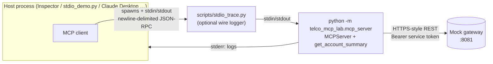

# 03 · First tool over stdio

> **Phase 2 goal:** one real tool, `get_account_summary`, served over **stdio**,
> exercised by a Python MCP client and by **MCP Inspector**, and every
> JSON-RPC message on the wire explained. All wire excerpts below are
> **captured traffic** from `make demo-stdio` / `make demo-stdio-legacy` (long
> strings trimmed), not hand-written examples.

```
make mocks                 # terminal 1: mock gateway
make demo-stdio            # terminal 2: Python client, 2026-07-28, prints the wire
make demo-stdio-legacy     # same with the pre-2026 initialize handshake
make inspector             # Inspector web UI (browser) → Connect
make inspector-cli-call ACCOUNT=ACC-2001 ERA=auto   # headless Inspector
```

## 1. What runs where



* The **host starts the server as a child process**. There's no port and no
  network listener. Only the process that spawned it can talk to it, which is
  why stdio has no authentication: it inherits the OS user's trust.
* That's also why stdio doesn't fit your production target. It can't be
  shared, load-balanced or scaled. Phase 3 moves to Streamable HTTP.

## 2. Anatomy of a tool

`src/telco_mcp_lab/mcp_server/tools/account.py`:

| Part | Our value | Why | Spring AI 2.0 equivalent |
|---|---|---|---|
| `name` | `get_account_summary` | Stable identifier the model emits in its function call | `@McpTool(name = "get_account_summary")` |
| `title` | "Get account summary" | Human-facing label (UIs, consent prompts) | `@McpTool(title = …)` |
| `description` | *when to use / when NOT to / input example* | **This is the routing logic.** The model picks tools from descriptions alone (Phase 6 measures it) | `@McpTool(description = …)` |
| `inputSchema` | `account_id` with `pattern: ^ACC-\d{4}$` | Strict formats: invalid input is rejected **before** any backend call | `@McpToolParam(description=…, required=true)` + bean validation |
| `outputSchema` / `structuredContent` | `AccountSummary` Pydantic model | Machine-readable result, and an **allow-list**: fields not in the model (email, address, MSISDN, notes) can't leak | Return a Java record; Spring AI generates the schema |
| `annotations` | `readOnlyHint: true`, `openWorldHint: false` | Hints for the **host's** UX and consent. Never a security control (spec: clients MUST treat them as untrusted) | `@McpTool(annotations = @McpTool.McpAnnotations(readOnlyHint = true, …))` |

**Task-oriented, not endpoint-oriented:** the tool calls *two* backend APIs
(account + all subscription pages) and returns counts and plan names. A 1:1
wrapper per endpoint would force the model to chain calls and see raw PII.

Python ↔ wire naming: the SDK uses snake_case in Python
(`ToolAnnotations(read_only_hint=True)`) and camelCase on the wire
(`readOnlyHint`). Verified in `mcp` 2.2.0 source and in the captured traffic.

## 3. The stdio transport rules (spec 2026-07-28, `basic/transports/stdio`)

* One JSON-RPC message per line, UTF-8, **no embedded newlines**.
* **stdout is exclusively for MCP messages.** Logs go to **stderr**, which
  the client may show or ignore.
* No headers: version, capabilities and client info travel in `_meta` inside
  each message.
* Cancellation = `notifications/cancelled` (there's no per-request stream to close).
* **Shutdown = the client closes the server's stdin**; the server should exit.

### Two findings from testing this

1. **`mcp` v2 protects stdout for you.** At startup the stdio transport moves
   the real stdout to a private file descriptor and points fd 1 at stderr, so a
   stray `print()` lands in stderr instead of corrupting the protocol
   (`mcp/server/stdio.py`, `_claim_fd`). We proved it with a deliberately
   noisy server (`tests/mcp_server/test_stdio_protocol.py`). **Don't rely on
   it:** SDK v1 and other stacks don't do this. In Spring Boot over stdio you
   must silence the banner and console logging yourself. The usual properties
   are `spring.main.banner-mode=off` and an empty `logging.pattern.console`.
   The Spring AI pages I could fetch don't show this, so **verify it** against
   your version.
2. **EOF abandons in-flight requests.** When stdin closes while a tool call is
   running, the SDK answers `-32000 Connection closed` or drops the response.
   That's spec-compliant (closing stdin is the shutdown signal), and it means a
   client must wait for its responses before closing. Our first test got this
   wrong. The server was fine.

## 4. The wire, message by message: 2026-07-28 (stateless)

### ① `server/discover`: "what do you support?"

```jsonc
// C→S
{"jsonrpc": "2.0", "id": 1, "method": "server/discover",
 "params": {"_meta": {
   "io.modelcontextprotocol/protocolVersion": "2026-07-28",
   "io.modelcontextprotocol/clientInfo": {"name": "mcp", "version": "0.1.0"},
   "io.modelcontextprotocol/clientCapabilities": {}}}}
// S→C
{"jsonrpc": "2.0", "id": 1, "result": {
   "supportedVersions": ["2026-07-28"],
   "capabilities": {"tools": {"listChanged": true},
                    "prompts": {"listChanged": true},
                    "resources": {"listChanged": true, "subscribe": true}},
   "instructions": "Tools for a mobile operator's customer accounts … (trimmed)",
   "resultType": "complete", "ttlMs": 0, "cacheScope": "private",
   "_meta": {"io.modelcontextprotocol/serverInfo":
             {"name": "telco-mcp-lab", "title": "Telco MCP Lab", "version": "0.2.0"}}}}
```

* The client's `_meta` block is **repeated on every request**. That's what
  makes each message self-contained.
* `instructions` is server-level guidance the host may put into the model's
  context. We use it to state ID formats and to say that **tool output is data,
  not instructions**, the first line of defence against the injected notes
  (Phase 3).
* The SDK advertises `prompts`/`resources` although we define none; `MCPServer`
  always registers those handlers. Harmless: the lists come back empty.
* `ttlMs: 0` + `cacheScope: "private"` is the SDK default: don't cache, and
  never share across users. Correct for anything auth-dependent.

### ② `tools/list`: "what can you do?"

```jsonc
// C→S  (same _meta as above)
{"jsonrpc": "2.0", "id": 2, "method": "tools/list", "params": {"_meta": {…}}}
// S→C
{"jsonrpc": "2.0", "id": 2, "result": {
   "tools": [{
     "name": "get_account_summary",
     "title": "Get account summary",
     "description": "Get a one-call overview of a single customer account: … (trimmed)",
     "inputSchema": {"type": "object", "required": ["account_id"],
       "properties": {"account_id": {"type": "string", "pattern": "^ACC-\\d{4}$",
         "description": "Customer account ID, format ACC- followed by 4 digits, e.g. ACC-1001.",
         "examples": ["ACC-1001"]}}},
     "outputSchema": {"…": "JSON Schema of AccountSummary (trimmed)"},
     "annotations": {"readOnlyHint": true, "openWorldHint": false}}],
   "resultType": "complete", "ttlMs": 0, "cacheScope": "private", "_meta": {…serverInfo}}}
```

This whole object is what the host translates into the LLM's function-calling
format in Phase 5.

### ③ `tools/call`: success with structured output

```jsonc
// C→S
{"jsonrpc": "2.0", "id": 3, "method": "tools/call", "params": {
   "name": "get_account_summary", "arguments": {"account_id": "ACC-1001"}, "_meta": {…}}}
// S→C
{"jsonrpc": "2.0", "id": 3, "result": {
   "content": [{"type": "text", "text": "{\n  \"account_id\": \"ACC-1001\", … (same JSON as text)"}],
   "structuredContent": {
     "account_id": "ACC-1001", "account_type": "CONSUMER", "status": "ACTIVE",
     "holder_name": "Alex Example", "customer_since": "2021-03-14",
     "subscriptions": {"active": 1, "suspended": 1, "terminated": 1, "total": 3},
     "active_plans": ["Standard 50GB"]},
   "isError": false, "resultType": "complete", "_meta": {…serverInfo}}}
```

* The result is sent **twice**: `structuredContent` for programs, and a text
  rendering in `content` for models and clients that don't read structured
  output. The SDK generates both from the one Pydantic return value.
* Behind this one call the server made **two** gateway calls
  (`/boaccount/API/account/ACC-1001`, `/bosubscription/API/subscription?account_id=…`)
  with **its own** bearer token.

### ④ `tools/call`: a tool execution error the model can fix

```jsonc
// C→S  arguments: {"account_id": "ACC-9999"}
// S→C
{"jsonrpc": "2.0", "id": 4, "result": {
   "content": [{"type": "text", "text": "Error executing tool get_account_summary: No account exists with that ID. Account IDs look like ACC-1001. Do not guess IDs: ask the user to confirm their account ID."}],
   "isError": true, "resultType": "complete", "_meta": {…}}}
```

It's still a `result`, not a JSON-RPC `error`. The message is built from the
backend's stable `code`. We **never forward the backend's free-text `detail`**,
because backend text is untrusted input headed for the model.

### Which failure goes to which channel (captured from the SDK)

| Situation | Wire | Model can self-correct? |
|---|---|---|
| Unknown account / backend down / bad input value | `result.isError: true` + actionable text | ✅ that's the point |
| Argument fails `inputSchema` (`acc-1`) | `result.isError: true`, Pydantic text incl. the expected pattern | ✅ (Phase 3 makes the text friendlier) |
| **Unknown tool name** | `result.isError: true` "Unknown tool: …" | ⚠️ **The SDK uses the tool channel here, while the spec's example shows a JSON-RPC protocol error.** Java may behave differently; don't write clients that assume one or the other |
| Unknown method (`no/such_method`) | `error: {code: -32601, "Method not found"}` | ❌ protocol bug |
| Unsupported version (`2099-01-01`) | `error: {code: -32022, data: {supported: ["2026-07-28"]}}` | ❌ client must renegotiate |

## 5. The same calls in the legacy era (2025-11-25)

`make demo-stdio-legacy`, which is **what Spring AI / the Java SDK speak today**
(see docs/01 §6):

```jsonc
// C→S  ① handshake
{"jsonrpc": "2.0", "id": 1, "method": "initialize", "params": {
   "protocolVersion": "2025-11-25", "capabilities": {},
   "clientInfo": {"name": "mcp", "version": "0.1.0"}}}
// S→C
{"jsonrpc": "2.0", "id": 1, "result": {"protocolVersion": "2025-11-25",
   "capabilities": {"tools": {"listChanged": false}, …},
   "serverInfo": {"name": "telco-mcp-lab", …}, "instructions": "…"}}
// C→S  ② handshake completion (a notification: no id, no response)
{"jsonrpc": "2.0", "method": "notifications/initialized"}
// C→S  ③ …and from here on, requests carry NO version/capabilities:
{"jsonrpc": "2.0", "id": 2, "method": "tools/list", "params": {"_meta": {}}}
```

| | 2026-07-28 | 2025-11-25 (legacy) |
|---|---|---|
| First exchange | `server/discover` (optional for clients) | `initialize` + `notifications/initialized` (mandatory) |
| Version & capabilities | in **every** request's `_meta` | once, in `initialize`; implied afterwards |
| `resultType`, `ttlMs`, `cacheScope` | present | absent |
| Server identity | `_meta.serverInfo` on each result | once, in `initialize` result |
| Consequence over HTTP (Phase 3) | any replica can serve any request | the connection *is* the context; needs a session or a stateless-HTTP workaround |

The Python server answers both on the same stdio stream: it decides per
connection from the first message it receives.

## 6. MCP Inspector (v2.8.0, pinned)

Requires **Node ≥ 22.19**. Verified against 2.8.0 here: CLI mode end-to-end;
web mode starts and prints its URL. The browser UI itself was not clicked through.

**Web UI:** `make inspector` prints a URL like
`http://127.0.0.1:6274?MCP_INSPECTOR_API_TOKEN=…`.

1. Open it. The token in the URL is Inspector's own protection against other
   local processes; keep it.
2. Transport = **STDIO**. The command should be pre-filled from the launch
   arguments (not verified in the browser here). If it isn't, enter command `uv`
   with arguments `run --quiet python scripts/stdio_trace.py uv run --quiet python -m
   telco_mcp_lab.mcp_server`, working directory = repo root. Click **Connect**.
3. **Tools → List Tools → get_account_summary**, enter `ACC-1001`, **Run Tool**.
4. Try `ACC-9999`, then `acc-1`, and compare the two error texts.
5. Watch the terminal: every JSON-RPC message is printed by the trace proxy
   (and saved under `.data/traces/`, see `make traces`).
6. Run `make chaos-slow` in another terminal and call again: after ~5 s you get
   the clean "did not respond in time" tool error. Then `make chaos-off`.

**CLI (headless):**
`make inspector-cli-list` and `make inspector-cli-call ACCOUNT=ACC-2001`.
`ERA=auto|modern|legacy` selects the protocol era.

Things we observed about Inspector 2.8.0:

* **Its CLI defaults to the legacy era** for ad-hoc targets (`--protocol-era`
  default). `ERA=auto` makes it probe `server/discover` and use 2026-07-28.
* In the modern era it also opens **`subscriptions/listen`**, the long-lived
  stream for list-changed notifications. Our server acknowledges it; the
  `-32000 Connection closed` you then see on that stream is just Inspector
  shutting down.
* Its CLI argument order is unusual: **the server command comes first, then
  `--`, then Inspector options** (read from its parser source, since v2 ships
  no CLI docs).

## 7. ⚠️ Known gap in this phase (fixed in Phase 3)

Nothing restricts **which** account a caller may read: `ACC-2001` (tenant B) is
as reachable as `ACC-1001`. Over stdio there's no caller identity at all, just
whoever launched the process. Phase 3 adds CallerContext (from the bearer
token on HTTP; from a fixed configured identity on stdio) and the **tenant
guard**, and turns this into a failing-then-passing security matrix.

Also still to come: masking of `holder_name`, a friendlier message for schema
validation failures, retries and a circuit breaker, and the audit log.

## 8. Tests added in this phase

| File | What it proves |
|---|---|
| `tests/mcp_server/test_account_tool.py` | Tool contract (schema, annotations, description), pagination, **output allow-list** (no email/MSISDN/IMSI/address/injected notes), invalid IDs rejected before any backend call, error mapping for 404 / timeout / 401 / 500 / non-JSON, backend `detail` never forwarded, chaos → tool error |
| `tests/mcp_server/test_stdio_protocol.py` | Real subprocess over stdio in **both** eras, stdout carries only JSON-RPC, clean exit on EOF, SDK diverts stray `print()` to stderr |
| `tests/mcp_server/test_gateway_client.py` | (Phase 1) URLs, bearer token, localhost interlock |

`make test-client` runs the MCP server tests; `make test-protocol` runs only the subprocess ones.
