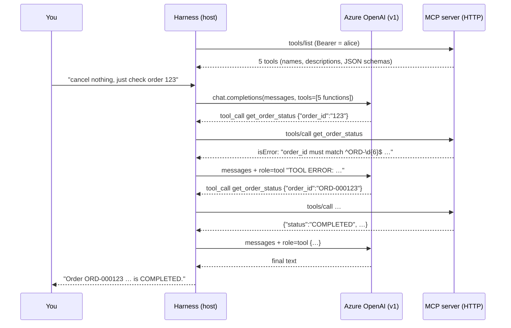

# 05 · The LLM harness: Azure OpenAI as the MCP host

> **Phase 5 goal:** see exactly how LLM-driven "routing" works. The harness is
> the **host**: it connects to our MCP server as a **client**, offers the tools
> to **Azure OpenAI** (function calling), executes the model's tool calls over
> MCP itself, and loops until the model answers, printing every step. It does
> **not** use Azure's server-side remote-MCP feature: our server stays local/private.

```
make mocks            # terminal 1
make mcp-http         # terminal 2
make harness-check    # terminal 3: MCP ✅ + Azure settings ✅ + one tiny completion ✅
make ask Q="what plans am I on?"             # one question, full trace
make ask Q="list my lines" CALLER=bob        # another identity
make chat                                    # multi-turn
```

## 1. Where "routing" actually happens



There is **no router**. The model picks a tool from the names, descriptions and
JSON schemas in `tools/list`, nothing else. That's why tool descriptions are
product code, and why Phase 6 measures them.

The trace below is **real harness output**, with the model's decisions scripted
(Azure isn't reachable from the build sandbox). It shows the self-correction
path: the server's schema error teaches the model the ID format.

```
[host] 5 MCP tools offered to the model: ['get_account_summary', 'list_subscriptions', 'get_service_details', 'get_order_status', 'list_orders']

👤 USER: cancel nothing, just check order 123
🧠 LLM step 1 (0.0s): decided → 1 tool call(s)
   🔧 MCP tools/call get_order_status {"order_id": "123"}
   ↩  ERROR (0.00s): TOOL ERROR: Invalid arguments for get_order_status: order_id: String should match pattern '^ORD-\d{6}$'. Correct them and call the tool again.
🧠 LLM step 2 (0.0s): decided → 1 tool call(s)
   🔧 MCP tools/call get_order_status {"order_id": "ORD-000123"}
   ↩  result (0.06s): {"order_id": "ORD-000123", "status": "COMPLETED", "action": "ADD_ADDON", "target": "ADDON-ROAM-EU", …}
🧠 LLM step 3 (0.0s): decided → final text
🤖 ANSWER: Order ORD-000123 (EU Roaming Pass add-on on SUB-1001-01) is COMPLETED.
```

With real Azure you'll also see per-step latency and token usage. Every run is
also written to `.data/harness/run-*.jsonl`, which Phase 6's evaluation runner reads.

## 2. Code map (`src/telco_mcp_lab/harness/`)

| File | Role | Spring AI equivalent |
|---|---|---|
| `settings.py` | `AZURE_OPENAI_*`, `HARNESS_*` from `.env` | `spring.ai.azure.openai.*` properties |
| `llm.py` | `ChatModel` interface + `AzureChatModel` (Chat Completions) | `AzureOpenAiChatModel` / `OpenAiChatModel` |
| `bridge.py` | MCP tools → OpenAI functions; results → `role: tool` | `SyncMcpToolCallbackProvider` → `ToolCallback`s |
| `agent.py` | The loop + host guards + confirmation hook | `ChatClient` with internal tool execution (`ToolCallingManager`) |
| `trace.py` | Printed + JSONL step trace | Spring AI observability (Micrometer) / advisors |
| `__main__.py` | CLI: `--check`, one-shot, REPL | your application |

Spring AI runs this loop for you ("internal tool execution"). We write it by
hand so you can see it. In Java you'll mostly configure it, and you can switch
to user-controlled tool execution when you need the confirmation step.

## 3. Host guards (the host's job, not the model's or the server's)

| Guard | Behaviour | Test |
|---|---|---|
| Max steps (`HARNESS_MAX_STEPS=8`) | stops a looping model; reports `max_steps` | `test_max_steps_stops_a_looping_model` |
| Hallucinated tool name | not executed; `HOST ERROR` listing real tools goes back to the model | `test_hallucinated_tool_is_not_executed` |
| Invalid JSON arguments | not executed; error back to the model | `test_invalid_json_arguments_are_not_executed` |
| **Destructive tools** | **human y/N before execution**; default = deny; a decline is reported to the model ("do not retry") | `TestDestructiveConfirmation` (4 tests) |
| Read-only tools | never prompt (annotation `readOnlyHint: true`) | `test_read_only_tools_never_prompt` |
| Large results | truncated at 8k chars before going to the model | bridge |

"Destructive" follows the spec defaults: a tool that isn't annotated
`readOnlyHint: true` is treated as destructive unless `destructiveHint: false`.
Annotations are *hints*. We trust our own server's; the spec says clients MUST
treat annotations from untrusted servers as untrusted.

## 4. What leaves the building (data boundary)

Everything the model sees is sent to Azure OpenAI:

* the system prompt and your questions;
* **all tool definitions** (names, descriptions, schemas);
* **every tool result**.

That's the concrete reason Phase 3 masks PII, withholds instruction-like notes
and returns allow-listed fields: the MCP server's shaping decides what reaches
the provider. Tests assert the injected note never appears in anything sent to
the model (`test_injected_note_does_not_reach_the_model`). A caller without
scopes (mallory) sends **zero** tool definitions: the model never learns the
tools exist.

## 5. Azure OpenAI configuration (v1 endpoint)

```dotenv
AZURE_OPENAI_ENDPOINT=https://<resource>.openai.azure.com/openai/v1/
AZURE_OPENAI_API_KEY=…
AZURE_OPENAI_DEPLOYMENT=<your gpt-5 or gpt-4.x deployment name>
```

* Client: the plain `openai.AsyncOpenAI(base_url=<v1 endpoint>, api_key=…)`
  from `openai` **3.19.2**, with **no `api-version`** (the settings validator
  enforces the `/openai/v1/` suffix and https).
* ⚠️ **Not verified from the build sandbox:** learn.microsoft.com is blocked
  here, and `openai`'s own docs/examples only show the older `AzureOpenAI(api_version=…)`
  style. The v1 usage above is based on Microsoft's v1 guidance as I recall it.
  Hence: **run `make harness-check` first.** If the key is rejected (401), set
  `AZURE_OPENAI_AUTH_HEADER=api-key`; the harness then sends the key only in an
  `api-key` header (tested: no duplicate `Authorization`).
* The **deployment name** is what goes in the request's `model` field (tested).
* **GPT-5 vs GPT-4.x:** GPT-5-family (reasoning) deployments reject `temperature`
  and use `max_completion_tokens`. The harness sends **no sampling knobs by
  default**; set `AZURE_OPENAI_TEMPERATURE` (GPT-4.x) or
  `AZURE_OPENAI_REASONING_EFFORT` (GPT-5) only if your model supports them.
* Chat Completions is used (not the Responses API) because it behaves the same
  on both model families and maps 1:1 to Spring AI. Only `llm.py` would change.

### Corporate HTTPS proxy

* `openai` 3.x uses **`httpx2`**, which honours `HTTPS_PROXY` and `SSL_CERT_FILE`
  from the environment automatically (verified in source; `trust_env=True`).
* Or set `AZURE_OPENAI_PROXY` (credentials may go in the URL) and
  `AZURE_OPENAI_CA_BUNDLE` (a PEM with your corporate root CA if the proxy
  inspects TLS). A missing CA file fails fast with a clear message.
* **Finding: local traffic must bypass the corporate proxy.** On a laptop with
  `HTTP(S)_PROXY` set, the harness → MCP (127.0.0.1) and MCP → gateway
  (127.0.0.1) calls would otherwise be sent to the corporate proxy and fail.
  Both local clients now ignore proxy environment variables (`trust_env=False`
  for local targets). A test with a dead proxy in `HTTP_PROXY` proves it, and
  was mutation-checked.

### `make harness-check` diagnostics

It checks MCP, then settings, then one tiny completion, and maps failures to
hints, walking the exception's cause chain (SDKs wrap the real reason in
"Connection error."). Captured in the sandbox, whose egress proxy blocks Azure:

```
[1/3] MCP server http://127.0.0.1:8090/mcp as 'alice' …
      ✅ protocol 2026-07-28, tools: ['get_account_summary', …]
[2/3] Azure OpenAI settings …
      ✅ endpoint https://lab-resource.openai.azure.invalid/openai/v1/, deployment 'gpt-5-lab'
         auth header bearer, proxy set, CA bundle /root/.ccr/ca-bundle.crt
[3/3] Azure OpenAI round trip (one tiny completion, no tools) …
      ❌ APIConnectionError: Connection error. <- ProxyError: 403 Forbidden <- …
   → Proxy refused/failed: check HTTPS_PROXY / AZURE_OPENAI_PROXY (and proxy credentials, …)
```

(An earlier version blamed that proxy 403 on Azure RBAC. Hints are now matched
most-specific-first, and there's a test for it.)

## 6. Tests (all offline: `make test-harness`)

| File | What it proves |
|---|---|
| `test_agent.py` | scripted LLM + **real** MCP server: tool format, single/multi-step, self-correction from a tool error, parallel calls answered in order, history, guards, injection never reaches the model, confirmation (declined/approved/default-deny/read-only no prompt), JSONL trace |
| `test_azure_adapter.py` | the real `openai` SDK against a **mocked Azure v1 endpoint** (`httpx2.MockTransport`): URL (no api-version), Bearer vs `api-key` header (key sent once), `model` = deployment, no sampling knobs by default, tool_calls parsing, settings validation, **full loop: mocked Azure decides → real MCP executes** |
| `test_harness_http.py` | harness over real HTTP in both eras as bob (own data only); mallory offers the model zero tools; diagnostic hints incl. cause chain and proxy-403 |
| `test_resilience.py` (+1) | local gateway calls ignore a dead `HTTP(S)_PROXY` |

## 7. What to try on your machine

1. `make harness-check` until all three steps are ✅.
2. `make ask Q="what plans am I on?"`. Alice has two accounts, so watch the
   model receive "several accounts … ask which one" and come back to you.
3. `make ask Q="is roaming on for my main number?"`. Expect a two-step chain,
   `list_subscriptions` → `get_service_details`.
4. `make ask Q="show me account ACC-2001" `: tenant guard, indistinguishable "not available".
5. `make ask Q="what's on my account?" CALLER=bob`, then with `CALLER=mallory`.
6. `make ask Q="read me my account notes"`: the injected note is withheld; the
   model can only say a note exists.
7. Compare GPT-5 vs GPT-4.x deployments on the same questions. Phase 6 turns
   this into numbers.
