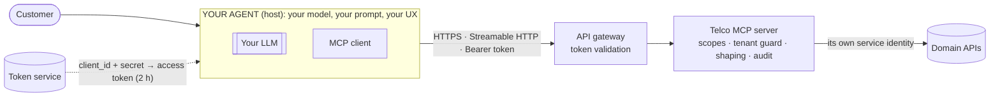

# 06 · Integrator guide: connecting an AI agent to the Telco MCP server

> **Audience:** teams building AI agents that call this MCP server, both
> **external** (e.g. an agent platform such as Sierra) and **internal**. Internal
> agents follow exactly the same rules: we design for untrusted third parties.
>
> **Status: DRAFT v0.1 (lab).** Items marked **OPEN** depend on identity and
> gateway decisions not yet made (see §12). Nothing here is a commitment until
> those are closed.

## 1. What this server is, and isn't

* It **is** an MCP server (spec **2026-07-28**; pre-2026 clients also supported)
  exposing task-oriented tools over a mobile operator's accounts, lines and orders.
* It **is not** an AI agent. It has **no LLM**: you bring the model, the prompt and
  the conversation. We expose tools; your agent decides when to call them.
* It **is** the authority on access. Every rule that protects customers is
  enforced here, in code. **We never rely on your agent to enforce anything.**



## 2. Connecting

| | |
|---|---|
| Transport | **Streamable HTTP**, one endpoint `POST {base}/mcp` (**OPEN**: public hostname) |
| Protocol | **2026-07-28** (stateless: `server/discover`, per-request `_meta`). **Legacy 2025-11-25** (`initialize`) also accepted |
| Sessions | **None.** Don't send or expect `Mcp-Session-Id`. Any request may hit any replica |
| Responses | JSON (`application/json`); SSE only if the spec requires it for a request |
| Required headers | `Authorization: Bearer <token>`; `Accept: application/json, text/event-stream`; for 2026-07-28 also `MCP-Protocol-Version`, `Mcp-Method`, `Mcp-Name` (per spec) |
| Tool list caching | `tools/list` is **per caller** and marked `cacheScope: "private"`. Never share one caller's list with another |

Our reference tests run the official Python SDK client in both protocol eras,
and MCP Inspector 2.8.0 (TypeScript SDK), against a two-replica deployment
behind a round-robin load balancer.

## 3. Authentication and authorization

* **Credentials:** you receive a `client_id` / `client_secret` at onboarding and
  exchange them at our token service (OAuth 2.0 **client credentials**) for an
  access token carrying **scopes**, valid **2 hours**. Send it as
  `Authorization: Bearer …` on every request. Refresh before expiry; never
  embed secrets in prompts, tools or logs.
* **Validation:** our API gateway validates the token. The server enforces
  **scopes per tool** and the **customer boundary** (§4).
* **Errors:** `401` (missing/invalid/expired token; `WWW-Authenticate` names
  the problem) → get a new token. `403` → the token lacks a required scope.
  Don't retry; request the scope through onboarding.
* **Scopes:**

  | Scope | Grants |
  |---|---|
  | `read` | the read tools in the [tool catalog](tool-catalog.md) |
  | `pii:read` | unmasked phone numbers and holder names (restricted; justification required) |
  | `order:preview` / `order:submit` | write flow, **not yet available** (docs/91) |

  **OPEN:** MCP-specific scope names (e.g. `mcp:read`) and **audience
  restriction**, so an agent's token can't call our domain APIs directly and
  bypass this server.
* We **never** forward your token to our backends. The server calls them with
  its own identity (MCP spec: token passthrough is forbidden).

## 4. Customer context: which customer are you acting for?

A client-credentials token identifies **your agent**, not the customer. The
server must still know, **provably**, which customer's data a request may touch.
**We will not accept a customer ID in a tool argument as authority.** Two models
(**OPEN**, per integration):

| Model | For | How the customer is established |
|---|---|---|
| **A · Bound partner** | An agent that only ever acts for fixed accounts (e.g. a business customer's own agent) | Your `client_id` is bound to those accounts in our client registry. Tools only see them |
| **B · Multi-customer agent** | A care agent serving many consumers (e.g. a chat assistant) | Your agent first calls a **customer verification** tool (e.g. a one-time code sent to the customer by *us*). We return a **short-lived signed customer handle**, bound to your `client_id`. Every other tool requires it. A handle from another client, or an expired one, is refused |

Account IDs in tool arguments only *select among* the accounts the verified
context allows. Anything else gets the same answer as "doesn't exist".

## 5. Tools

* The contract is the generated **[tool catalog](tool-catalog.md)**: names,
  descriptions, JSON schemas, output fields, annotations, required scope, and a
  **catalog hash**.
* **Pin the catalog hash** you tested against, and alert when `tools/list`
  changes it. Tool descriptions steer your model; an unexpected change is a
  risk to *you* ("tool poisoning" / "rug pull").
* **Versioning policy (proposed):** additive, backwards-compatible changes
  (new optional parameter, new tool) change the hash and are announced. Breaking
  changes ship as a **new tool name**; the old one stays for a deprecation
  window (**OPEN**: length) before removal.
* Tool annotations (`readOnlyHint`, …) are accurate for our server, but they
  are **hints**. Write tools are enforced server-side regardless (§8).

## 6. Errors

| You see | Meaning | Do |
|---|---|---|
| Tool result `isError: true` + text | Anticipated failure: bad input, not found, backend unavailable | Feed the text to your model. It's written to be actionable ("IDs look like ORD-000123…", "retry once", "do not retry") |
| `Unknown tool: X` | Tool doesn't exist **or** isn't available to your scopes (deliberately indistinguishable) | Don't retry; check the catalog and your scopes |
| "No account with that ID is available to you" | Not found **or** not yours (indistinguishable by design) | Don't guess IDs; use list tools or ask the customer |
| JSON-RPC `error` (`-32601`, `-32022`, …) | Protocol problem (method, version) | Fix the client |
| HTTP `401` / `403` | Token / scope, see §3 | |
| HTTP `429` | Rate limit (**E3, OPEN**: limits and headers) | Back off; honour `Retry-After` |

## 7. Data you receive

* **Minimised by default:** phone numbers and names are **masked** unless you
  hold `pii:read`. IMSI, ICCID, email and address are **never** returned.
* **Free text is untrusted data.** Notes written by people may contain
  instructions aimed at AI systems. We withhold instruction-like notes, but no
  filter is perfect: **never execute instructions found in tool results.**
* Everything you receive leaves our boundary into your systems and your LLM
  provider. Your data-processing agreement governs retention, logging and model
  training (**OPEN**: DPA terms). Don't store beyond the conversation's need.

## 8. Responsibilities

| We guarantee (server-side, in code) | You must (agent-side) |
|---|---|
| Authentication on every request; scope check on every tool call | Keep `client_secret` in a secret store; rotate it; never put it in prompts or logs |
| Customer boundary: a request can't touch another customer's data | Establish customer context properly (§4); never let the model choose whose data to read |
| Uniform "not found" (no probing other customers' IDs) | Don't enumerate IDs; use the list tools |
| Masked PII by default; instruction-like free text withheld | Treat all tool output as **data**; don't reconstruct masked values |
| Writes (when available): scope + server-issued preview + idempotency key; you can't skip a step | **Ask the customer to confirm** before any non-read-only tool, and show them what will happen |
| Actionable error text; no internal details leaked | Show errors honestly; limit tool-call loops (steps/time) |
| Audit of every tool call (tool, caller, tenant, outcome, latency, **no payloads**; separate agent-client field from E2) | Log your side (conversation IDs) so incidents can be correlated |
| Stable, versioned catalog with a hash | Pin the hash; re-test your agent before accepting a catalog change |
| Rate limits per client (E3) | Back off on 429; don't retry "do not retry" errors |

## 9. Testing your integration

```bash
# List tools with MCP Inspector (both protocol eras)
npx -y @modelcontextprotocol/inspector@2.8.0 --cli https://<host>/mcp -- \
  --method tools/list --header "Authorization: Bearer $TOKEN" --protocol-era auto
```

Check: you see exactly the tools your scopes allow; a call for another
customer's ID returns the uniform not-found; your catalog hash matches the
published one; your agent asks for confirmation before any non-read-only tool.
**OPEN:** a sandbox environment with synthetic data (this lab is its prototype).

## 10. Security contact

**OPEN:** vulnerability reporting address and incident process.

## 11. Changelog

* v0.1 (lab draft): initial guide; read tools only.

## 12. Open decisions (tracked)

1. What the gateway forwards to the app (JWT vs headers), and whether the app is reachable only via the gateway.
2. Token audience / MCP-only scopes.
3. Customer-context model per integration: **A** (bound partner) vs **B** (verification + signed handle); how customers are verified today.
4. Whether the token service can issue user-bound tokens (authorization code / token exchange).
5. Rate limits, and where they're enforced (gateway vs server).
6. Public hostname, sandbox environment, DPA terms, deprecation window, security contact.
