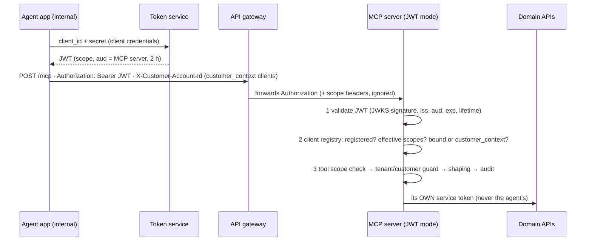

# 07 · Running internally: JWT auth, client registry, customer context (E2)

> **Goal:** a version of the MCP server you can run internally, authenticating
> the **real token service's JWTs** instead of the lab's static tokens.
> **Status:** built and tested against a *local stand-in* for the token service.
> Pointing it at your real token service needs the values in §6, which I could
> not verify from here.

## 1. What happens on each request



## 2. Token validation (`security/jwt_verifier.py`)

Every failure returns `401` with `WWW-Authenticate: Bearer error="invalid_token"`.
The server log gives the reason (`expired`, `InvalidAudienceError`, `unknown kid`,
`lifetime too long`, …), **never the token**.

| Check | Why |
|---|---|
| `alg` on an allow-list of **asymmetric** algorithms (default `RS256`); `none`/`HS*` refused at config load **and** per token | blocks `alg=none` and the HS256-with-the-public-key confusion attack (both tested) |
| `kid` must be in the token service's JWKS; the JWK's own `alg` must match | a forged token with a known `kid` fails the signature (tested) |
| signature with exactly that key + algorithm | |
| `iss` exact match | tokens from another issuer are useless |
| `aud` contains `MCP_JWT_AUDIENCE` | RFC 8707 audience restriction: you confirmed the token is **restricted to the MCP server**, so a token for the domain APIs can't be replayed here (and ours can't be replayed there) |
| `exp`/`nbf` with `MCP_JWT_LEEWAY_S` (30 s) skew; `exp, iat, iss, aud` required | |
| `exp − iat ≤ MCP_JWT_MAX_LIFETIME_S` (7200) and `iat` not in the future | the service issues 2 h tokens; a longer one wasn't minted by the normal flow |
| token ≤ 8 KB | bounds parsing work |

**Keys (JWKS):** fetched with our own `httpx` client (explicit proxy/CA settings;
`PyJWKClient` would silently use `HTTP(S)_PROXY`), cached for 1 h, refetched when an
unknown `kid` appears (key rotation), **at most once a minute**, so a flood
of junk tokens can't hammer the token service. If a refresh fails, cached keys stay in use.
If there are no keys at all, every request gets 401 (fail closed). All of this is tested.

**Scope headers from the gateway are ignored.** Authorization uses only the
signed token. Headers are only trustworthy if nothing can reach the server
except through the gateway, and the token is the stronger proof anyway.

## 3. Client registry (`config/clients.json`)

A valid token is **necessary, not sufficient**: the `client_id` must be
registered.

```json
"care-agent-internal": { "mode": "customer_context", "allowed_scopes": ["read", "pii:read"] },
"ops-dashboard":       { "mode": "bound", "tenant": "tenant-a", "allowed_scopes": ["read"] }
```

* **Effective scopes = token scopes (mapped via `scope_map`) ∩ `allowed_scopes`.**
  A mis-issued token can't grant more than the registry allows. Unknown token
  scopes are ignored.
* **Unregistered client:** sees no tools, and every call answers `Unknown tool`.
  It's audited with its `client_id` so you can see who tried.
* **`bound`:** the client only ever sees its tenant's accounts. The customer header is ignored.
* **`customer_context`:** see §4.

The client IDs and scope names in the file are **placeholders**. Replace them
with your token service's real ones.

## 4. Customer context: `X-Customer-Account-Id`

You said the token is service-to-service and customer context comes "from the
API call they make … when they call with certain attributes". This server
implements that as **one request header** that the **agent application's code**
sets from its own session. The LLM never sets it:

* `X-Customer-Account-Id: ACC-1001` (or up to 10 comma-separated IDs) → the
  request can touch only those accounts. Tool arguments only *select among*
  them. Anything else gets the uniform "not found".
* Missing → no account data at all ("No customer is selected… do not retry with
  an account_id"). Malformed or **repeated** header → the same, plus a warning log.
* Honoured only for clients registered as `customer_context`. Audited on every call
  (`"customer":"ACC-1001"`).

> **Trust boundary, stated plainly:** the header is an *assertion* by an
> authenticated, registered internal client, not proof that the customer was
> verified. It's acceptable for internal agents you control. For third-party
> agents, replace it with a server-verified signed handle (docs/06 §4, model B2).

**Assumption to confirm (§6):** the attribute name and value format. If your
agents identify customers by MSISDN or a customer number rather than account ID,
the server needs a lookup (attribute → accounts) from an entitlement API.
That's a change I'd make once you share the contract.

## 5. Run it

**Local, with the dev token-service stand-in** (keys never leave `.data/`):

```bash
make dev-keys                      # RSA key (0600) + JWKS in .data/dev-keys
make mocks                         # terminal 1
make mcp-http-jwt                  # terminal 2: JWT mode, trusting the dev JWKS
make demo-jwt                      # terminal 3: 401s, bound vs customer-context, registry
make token CLIENT=care-agent-internal SCOPES="read pii:read"   # a token for Inspector/curl
make test-jwt                      # 71 tests: verifier, JWKS cache, registry, over-the-wire
```

Harness against a JWT-mode server: set `HARNESS_BEARER_TOKEN=$(make -s token CLIENT=…)` and
`HARNESS_CUSTOMER_ACCOUNT_ID=ACC-1001` (or `--customer ACC-1001`), then `make ask Q=…`.

**Against your real token service:** in `.env`:

```bash
MCP_AUTH_MODE=jwt
MCP_JWT_ISSUER=<exact iss>
MCP_JWT_AUDIENCE=<exact aud the service puts in MCP tokens>
MCP_JWT_JWKS_URL=https://<token service>/<jwks path>
MCP_PUBLIC_URL=https://<how agents reach /mcp>
MCP_ALLOWED_HOSTS=["<host the gateway calls us on>:*"]
# only if the JWKS fetch must use the corporate proxy / CA:
MCP_JWT_JWKS_TRUST_ENV=true
MCP_JWT_JWKS_CA_BUNDLE=/path/to/corp-root.pem
```

Then run `make mcp-http`. `/healthz` is unauthenticated liveness only (`{"status":"ok"}`).

## 6. To confirm with the token-service team (I couldn't verify these)

| # | Question | Setting it drives | Default assumed |
|---|---|---|---|
| 1 | Signing algorithm? (must be asymmetric; if they sign with **HS256**, stop: that means sharing their secret with us) | `MCP_JWT_ALGORITHMS` | `RS256` |
| 2 | Exact `iss` value | `MCP_JWT_ISSUER` | — |
| 3 | JWKS URL (or a PEM if they don't publish JWKS) | `MCP_JWT_JWKS_URL` | — |
| 4 | Exact `aud` for MCP tokens | `MCP_JWT_AUDIENCE` | — |
| 5 | Claim carrying the client ID | `MCP_JWT_CLIENT_ID_CLAIMS` | `client_id`, then `azp` |
| 6 | Scope claim name and format (space string / list) and **scope names** | `MCP_JWT_SCOPE_CLAIM`, `scope_map` | `scope` |
| 7 | Is `iat` always present? | `MCP_JWT_REQUIRED_CLAIMS` | yes |
| 8 | Which customer attribute(s) internal agents send, and its format | `MCP_CUSTOMER_HEADER`, parser | account ID(s) |
| 9 | Is the MCP server reachable **only** via the gateway? | network policy | assume **no**, hence full validation here |

Fastest way: decode one **non-production** token (header + payload only, no
signature) and share the claim names, not the token.

## 7. Before pointing it at real domain APIs

The lab's ground rule is **synthetic data only**. Running internally against
real gateways changes that, so it's deliberately not one switch:

* `GATEWAY_ALLOW_NON_LOCAL=true` is required for a non-localhost gateway, and it
  must be `https://`.
* The tool code maps the **mock** API responses (`clients/telco.py`). Real
  response contracts will differ; each mapping needs adapting and a contract
  test. The PII masking (`shaping/pii.py`) must be re-checked against real field names.
* Logs and audit then contain real account IDs: decide retention and access first.
* Rate limiting (E3) is still missing. The MCP spec says servers **MUST** rate-limit tools.

## 8. Spring AI / Java mapping

| Here | Spring |
|---|---|
| `JwtTokenVerifier` + `JwtSettings` | `spring-boot-starter-oauth2-resource-server`: `spring.security.oauth2.resourceserver.jwt.issuer-uri`/`jwk-set-uri`, `audiences`, `jws-algorithms` |
| lifetime / `iat` checks | a custom `OAuth2TokenValidator<Jwt>` added to `DelegatingOAuth2TokenValidator` |
| `ClientRegistry.context_for` | `JwtAuthenticationConverter` (client lookup, scope ∩ allowed → authorities) |
| `CustomerHeaderMiddleware` | a `OncePerRequestFilter` → request-scoped customer context bean |
| unauthenticated `/healthz` | Actuator `health` with `permitAll()`, details hidden |
