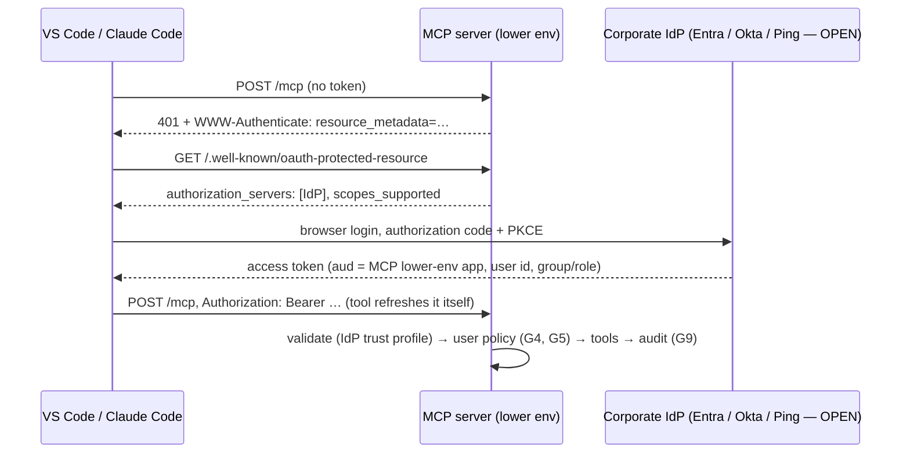

# 08 · Access, environments and guardrails

> **Status: v0.1, 2026-09-26.** Decisions from the lead: internal consumers only for now;
> **one shared client ID + secret for all lower environments**; **developer sign-in
> (SSO) for VS Code / Claude Code in lower environments** so people never handle tokens.
> Items marked **OPEN** need answers (§10). Items marked **BUILD** are designed but not
> implemented yet.

## 1. Principles

1. **Production is for agent applications, not people.** No human, laptop or coding tool
   ever holds a production credential or token.
2. **Environments are separated cryptographically, not just by process.** Every
   environment has its own token issuer and audience; the server rejects any token not
   minted for *it* (MCP spec: servers MUST validate the audience). A lower-env token
   presented to production is a 401.
3. **Lower environments hold synthetic data only.** Everything below assumes this. Shared
   credentials and SSO for many developers are acceptable *because* there is nothing real
   to leak. If a lower environment ever gets a copy of production data, this document no
   longer applies. Stop, and treat it like production.
4. **The server enforces; people and tools only follow guidelines.** Every MUST below says
   how it is enforced: in code, in configuration, or (weakest) by process.
5. **Least privilege by default.** `read` only unless a reviewed need says otherwise.

## 2. Environments and who uses what

| | Local (laptop) | Lower env (dev / test) | Production |
|---|---|---|---|
| Data | Synthetic mocks | **Synthetic only** | Real customers |
| MCP server auth | stdio (no auth) or dev keys (`make dev-keys`) | JWT: token service (lower-env issuer) **and** corporate SSO (BUILD) | JWT: production token service only |
| People (VS Code, Claude Code) | yes | **yes, via SSO sign-in** (preferred) or the shared helper | **never** |
| Automation (CI, test scripts, harness) | yes | shared lower-env client ID | never, except as a registered app |
| Agent apps | dev copies | test deployments | **registered production client IDs only** |
| Token issuer / audience | dev values | lower-env values | production-only values |
| Client registry | `config/clients.json` (sample) | lower-env registry | production registry (no lower-env IDs, no user access) |

## 3. The four ways in

**A. Developer sign-in (SSO) in lower environments.** For people using VS Code, Claude
Code or Inspector. **BUILD**, needs §10 answers.
- The developer adds the server URL. The tool gets a 401, reads our protected-resource
  metadata, opens the corporate login page, and stores and refreshes the token itself.
  No token handling, no shared secret on laptops.
- Every call is attributed to a person in the audit log.

**B. Shared lower-env client (client credentials).** For automation, and for developers
whose tool can't do SSO.
- One client ID and secret for all lower environments (lead decision), with the rules in §5.
- Tools use a token helper, never a pasted token:
  - Claude Code: `headersHelper`, which is re-run automatically on a 401.
  - VS Code and other tools: a local stdio bridge (**BUILD**).

**C. Production agent apps (client credentials).** The standard OAuth 2.0 flow in
application code (§7).

**D. Local stdio.** No auth. The process acts as `MCP_STDIO_CALLER` (MCP spec: stdio
servers take credentials from the environment, not OAuth). Mock data only.

## 4. Guardrails (MUST)

| # | Guardrail | Enforced by | Status |
|---|---|---|---|
| G1 | Tokens are accepted only from the configured issuer(s), with the exact audience of *this* environment, an asymmetric signature and ≤ 2 h lifetime | Server code (`jwt_verifier.py`) | ✅ enforced, tested |
| G2 | **Production refuses to start** with any lower-env-only setting: SSO (user) trust profile, JWKS *file*, dev issuer (`.invalid`), static lab tokens | Server startup check on `MCP_ENVIRONMENT=production` | **BUILD** |
| G3 | Only registered clients get anything; effective scopes = token ∩ registry | Server code (`clients.py`) | ✅ enforced, tested |
| G4 | SSO users must be in an approved group / app role (e.g. `MCP-LowerEnv-Testers`), assigned in the identity provider **and** re-checked by the server | IdP app assignment + server | **BUILD** |
| G5 | SSO users get lower-env policy only: `read`, synthetic tenant or customer header, never write scopes | Server policy for user principals | **BUILD** |
| G6 | Lower-env data is synthetic | Data management process + gateway points at mocks/test APIs | Process (**OPEN**: confirm) |
| G7 | The shared lower-env secret never appears in git, `.mcp.json` / `mcp.json`, `.env` files that are shared, tickets, chat, wikis or LLM prompts | Secret scanning (pre-commit + CI) + process | Process; scanning **BUILD** |
| G8 | Rate limits per client ID at the gateway (the shared client too) | Gateway config | **OPEN** (gateway supports it) |
| G9 | Every call audited with principal (client ID, or user ID for SSO), customer, tool, outcome; no payloads, no tokens | Server code | ✅ client + customer; user ID **BUILD** |
| G10 | Customer header only from application/tool configuration, never chosen by the model | Server policy + guidelines | ✅ for registered clients |
| G11 | Revocation works without a redeploy (kill switch) | Registry hot reload / suspend list | **BUILD** (docs/TODO.md) |

## 5. The shared lower-env client ID: rules

Accepted risk, stated plainly: a shared secret means **no attribution** (the audit log
sees one client, not a person), and every holder can impersonate every other holder.
It's acceptable only because of G1, G2 and G6: synthetic data, and cryptographically
useless outside lower environments.

- **Scope:** `read` only. Registered in the lower-env registry only (G3). Never in production.
- **Storage:**
  - The source of truth is the team secret manager (Vault / CredHub / password manager).
  - On laptops it lives in the OS keychain (macOS Keychain, Windows Credential Manager),
    read by the helper at run time.
  - Never in a file inside a repo, even a gitignored one.
- **Distribution:** only through the secret manager's access control. Never by email, chat
  or screenshare.
- **Rotation:** at least every 90 days, **immediately** when someone with access leaves the
  team, and on any suspected exposure.
  1. Issue a new secret.
  2. Update the secret manager.
  3. Announce "refresh your keychain".
  4. Revoke the old secret at the token service after a 24 h overlap.
- **Humans should prefer SSO (A)** once it exists. The shared client stays for CI and scripts.
- **Leak response:** rotate immediately (no overlap), review the audit log for that client
  ID since the suspected time, and note it in the team's incident log.

## 6. Developer sign-in (SSO) design (**BUILD**)

**Server changes:**
- **Several trust profiles:** a *client* profile (token service) and a *user* profile
  (IdP), each with its own issuer, JWKS, audience and claim mapping (user ID, scopes/roles,
  group).
- **A user policy in the registry:** required group or role, allowed scopes, and customer
  mode.
- **Protected-resource metadata** that points at the IdP.
- **The G2 startup guard** for production.
- **Audit fields** for principal type and user.

**Identity provider setup (per the IdP team):**
- One lower-env app registration representing the MCP server, with a scope or app role
  such as `mcp.read`.
- "Assignment required", limited to the tester group.
- A public-client registration for developer tools (loopback redirect URIs), unless the
  IdP supports Client ID Metadata Documents, which the MCP spec prefers.

**Tool configuration (after BUILD):**
- **VS Code:** the server URL plus `"oauth": {"clientId": "<public client id>"}`, with any
  secret kept in the OS secret store, not the file. Later: `"enterpriseManaged": true`
  (preview) when the IdP supports the MCP Enterprise-Managed Authorization extension.
- **Claude Code:** the server URL plus `oauth.clientId` and, if needed,
  `authServerMetadataUrl`; then sign in through `/mcp`.

**Alternatives considered:**
- **Our own OAuth login server:** rejected. It would be a security product of its own.
- **Enterprise-Managed Authorization (ID-JAG):** the best user experience (sign in once for
  all MCP servers), but it needs IdP support. Revisit later.

## 7. Production standard for agent apps

- The **OAuth 2.0 client credentials** grant, in application code. One client ID per app,
  in the production registry with reviewed scopes.
- The secret comes from the platform secret store (CredHub / Vault binding). Never from
  code, config files or laptops.
- **Tokens:**
  - cache in memory and refresh about 5 minutes before expiry, one refresh at a time;
  - on a 401, fetch a new token and retry **once**, then fail;
  - never log tokens.
- Send `Authorization` on every request. Set the customer header from the app's own
  session.
- **Coding tools (Claude Code, VS Code agents, CI bots) do not connect to production.** If
  an automated tool truly needs production, it's onboarded as an app (own client ID,
  review), never with a person's or the lower-env credential.

## 8. Guidelines for developers (lower environments)

**Do:**
- Sign in with SSO once available; otherwise use the helper.
- Keep secrets in the keychain.
- Test with the synthetic customers.
- Report anything that looks like real data immediately (G6).

**Don't:**
- Paste tokens or secrets into chats, prompts, tickets or config files in repos.
- Commit `.mcp.json` / `mcp.json` with headers containing credentials.
- Point lower-env tools at production URLs.
- Let the model choose the customer.

**Remember:** tool outputs go to your coding assistant's LLM provider. That's one more
reason lower environments must stay synthetic.

## 9. Incident response (lower env and production)

| Event | Action |
|---|---|
| Shared lower-env secret exposed | Rotate now (§5), review audit for that client ID, record |
| Production client secret exposed | Revoke at the token service + suspend in the registry (G11), rotate, audit review, security incident process |
| Real data found in a lower env | Stop access, remove the data, treat as a data incident |
| Tripwire (probing / scraping) fires | Throttle → suspend client → investigate (docs/TODO.md, E3) |

## 10. Open decisions

1. **Which corporate IdP** (Entra ID, Okta, Ping, other), and can the IdP team register the
   MCP lower-env app, a scope/app role and a public client for developer tools?
2. **Lower-env gateway:** will it accept SSO user tokens on the MCP route (pass-through with
   the MCP server validating), or does it only accept token-service tokens? If only the
   latter, the lower-env MCP route needs a gateway exception, or it is reachable on the
   internal network only.
3. **Lower-env data:** confirm synthetic only (G6).
4. **Who may sign in:** an approved group (recommended) or all engineers?
5. **SSO users' customer access:** a fixed synthetic test tenant, or allowed to set the
   customer header (fine on synthetic data, closer to production behaviour)?
