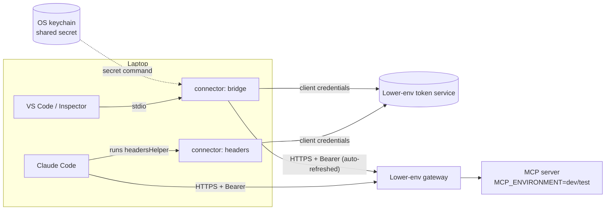

# 09 · Connecting VS Code, Claude Code and other MCP clients (lower environments)

> How a developer points their MCP client at a **lower-environment** MCP server using
> the **shared lower-env client ID** (docs/08 §3B, §5). Nobody pastes a 2-hour token:
> the connector gets one from the token service and refreshes it.
> Production is out of scope: people and coding tools never connect to production.

## 1. How it works



The connector is `python -m telco_mcp_lab.connect` in this repo:

| Command | For | What it does |
|---|---|---|
| `bridge` | VS Code, Inspector, any client that launches a **stdio** server | Forwards every MCP message to the remote HTTP endpoint with a fresh token. It refreshes 5 minutes before expiry, and once more on a 401 |
| `headers` | Claude Code `headersHelper` | Prints `{"Authorization": "Bearer …", …}`. Claude Code re-runs it on every connection **and after a 401** |
| `check` | You | Gets a token and lists the tools. Prints claims, never the token or secret |

## 2. One-time setup

**1. The secret goes in your OS keychain, never in a file.** Get it from the team secret
manager (docs/08 §5).

```bash
# macOS
security add-generic-password -s telco-mcp-lowerenv -a lowerenv-shared -w   # prompts for it
# Linux (libsecret)
secret-tool store --label="telco-mcp-lowerenv" service telco-mcp-lowerenv
```

**2. A non-secret config file**, e.g. `~/.config/telco-mcp/lowerenv.env` (outside any repo):

```bash
TELCO_MCP_URL=https://<lower-env-gateway>/<path>/mcp              # OPEN: gateway path
TELCO_MCP_TOKEN_URL=https://<lower-env-token-service>/<token-path> # OPEN: docs/07 §6
TELCO_MCP_CLIENT_ID=lowerenv-shared                                # the real shared ID
TELCO_MCP_SECRET_COMMAND=security find-generic-password -s telco-mcp-lowerenv -w
# Linux: TELCO_MCP_SECRET_COMMAND=secret-tool lookup service telco-mcp-lowerenv
TELCO_MCP_CLIENT_AUTH=basic          # or post: match the token service (docs/07 §6)
TELCO_MCP_CUSTOMER=ACC-1001          # synthetic test customer, set by YOU, never by a model
# TELCO_MCP_SCOPE=read               # only if the token service needs it
# TELCO_MCP_CA_BUNDLE=/path/corp-root.pem   # if TLS is intercepted
```

**3. Check it:** `make connect-check CONFIG=~/.config/telco-mcp/lowerenv.env`
→ `token ok: {...}` and `MCP ok: … tools [...]`.

**Corporate proxy:** set **both** `NO_PROXY` and `no_proxy` to include your internal
domains (and `127.0.0.1,localhost` for local testing). Some clients honour only one
spelling. In our test, Claude Code needed the lowercase one.

## 3. Claude Code: `headersHelper` (no bridge needed)

```bash
claude mcp add-json telco-lowerenv '{
  "type": "http",
  "url": "https://<lower-env-gateway>/<path>/mcp",
  "headersHelper": "uv run --quiet --directory /ABS/PATH/Intel-Inteligence-mcp python -m telco_mcp_lab.connect headers --config /ABS/HOME/.config/telco-mcp/lowerenv.env"
}'
claude mcp list        # → telco-lowerenv … ✓ Connected
```

Claude Code runs the helper **only after you accept its trust dialog** for the
project folder (a safety feature). Start `claude` there once and accept it. Use absolute
paths; the helper must answer within 10 seconds.

## 4. VS Code (and other stdio clients): the bridge

`.vscode/mcp.json`, or your user-level MCP configuration:

```json
{
  "servers": {
    "telco-lowerenv": {
      "type": "stdio",
      "command": "uv",
      "args": ["run", "--quiet", "--directory", "/ABS/PATH/Intel-Inteligence-mcp",
               "python", "-m", "telco_mcp_lab.connect", "bridge",
               "--config", "/ABS/HOME/.config/telco-mcp/lowerenv.env"]
    }
  }
}
```

No token or secret appears in this file, so committing a workspace `.vscode/mcp.json`
like this is safe. Keep paths absolute, or use VS Code variables such as
`${workspaceFolder}` where they apply.

> Verified: the bridge with the official Python SDK client (2026-07-28 and legacy
> protocol) and with Claude Code (`claude mcp list` → Connected). **Not yet verified
> in VS Code itself** (no VS Code in the build environment). Please confirm on your
> machine and report back.

## 5. Try it all locally first (no real credentials)

```bash
make dev-keys            # once
make env-tokens          # adds DEV_TOKEN_SERVICE_CLIENT_SECRET to .env if missing
make connect-local       # writes .data/connect/local.env for the local stack
make mocks               # terminal 1
make mcp-http-jwt        # terminal 2 (JWT mode; lowerenv-shared is tagged local/dev/test)
make dev-token-service   # terminal 3 (stand-in token service on :8095)
make connect-check       # terminal 4 → token ok + MCP ok
```

Then register it using `--config /ABS/PATH/Intel-Inteligence-mcp/.data/connect/local.env`
and `http://127.0.0.1:8090/mcp` in §3 or §4. Locally, the "secret command" reads the dev
secret from `.env`. Real lower environments use the keychain.

## 6. Rules (from docs/08, short version)

* Lower environments only. The shared credential is useless in production: different
  issuer and audience, and production refuses to start with it in its registry (G2).
* The secret lives in the keychain. Never in `mcp.json`, `.mcp.json`, `.env` files in repos,
  chat, tickets or prompts.
* The customer comes from your config (`TELCO_MCP_CUSTOMER` / `--customer`), never from
  the model. Use synthetic test customers.
* Suspect the secret leaked? Tell the owner so they can rotate (docs/08 §5).

## 7. Troubleshooting

| Symptom | Cause / fix |
|---|---|
| `connect: invalid configuration: url: …must be https` | Remote URLs must be https (only `127.0.0.1`/`localhost` may use http) |
| `TELCO_MCP_SECRET_COMMAND failed` | Keychain entry missing or named differently; run the command yourself |
| `token service refused the request: HTTP 401 invalid_client` | Wrong or rotated secret; refresh your keychain entry |
| `… HTTP 400 invalid_scope` | Drop `TELCO_MCP_SCOPE` or ask for `read` only |
| Error "token rejected: is this client registered for this environment?" (HTTP 401) | The token's issuer or audience isn't this server's: a token from another environment's token service, or wrong `TELCO_MCP_TOKEN_URL` |
| Connected, but **no tools** / "Unknown tool" | Token accepted, but `lowerenv-shared` isn't in this server's registry for this environment (or lacks `read`) |
| Claude Code: `headersHelper not run … trust` | Start `claude` in that folder and accept the trust dialog once |
| `ERR_PROXY_TUNNEL` / proxy 403 to an internal host | Add the host to **both** `NO_PROXY` and `no_proxy` |
| "No customer is selected for this request" | Set `TELCO_MCP_CUSTOMER` (or `--customer ACC-1001`) |
